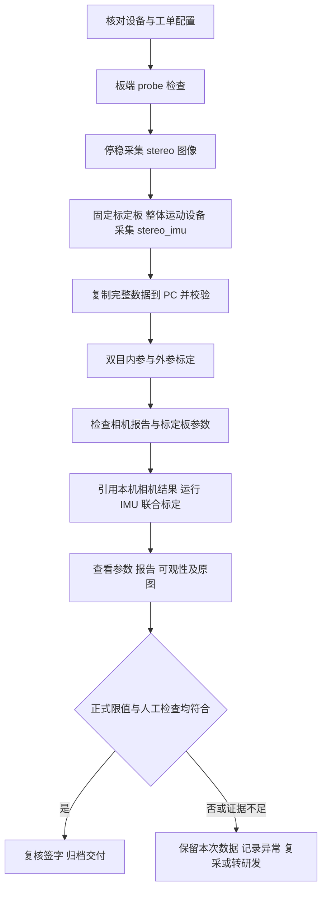

# 产线测试组标定 SOP：双目与双目＋IMU

文档版本：1.0.0；日期：2026-09-11。适用软件：calib_capture 1.0.0、Kalibr no-ROS 1.0.0。
滚动快门功能对应标定软件 tag `v1.0.0-rolling-shutter`。

适用对象：采集操作员、标定测试员、测试负责人。本文以 `mechine-00`、4K 双目、
`pinhole-equi`、8×10 AprilGrid 为示例。设备号、路径和时间后缀按工单填写；
图像模式、标定板、IMU 噪声参数及验收限值必须使用该机型确认的配置。

**采集检查通过、标定程序成功、参考评级良好，是三件不同的事，均不能单独代替产线放行。**
目前未提供正式产线限值；本文给出操作流程与评估方法，正式放行表中的限值由测试负责人填写。

## 1. 一页流程与岗位交接



| 步骤 | 执行端／责任人 | 完成后必须有 |
|---|---|---|
| 工位准备 | 工装维护／测试负责人 | 正确相机模式、软件版本、工单配置和验收限值 |
| 两类采集 | 板端／操作员 | `stereo_*`、`stereo_imu_*` 正式会话及采集校验报告 |
| 数据复制 | PC／操作员 | 完整数据目录，左右图像、CSV、`dataset.yaml`、`meta/` |
| 相机标定 | PC WSL/Linux／测试员 | 本机双目结果 YAML 和 HTML/PDF |
| IMU 联合标定 | PC WSL/Linux／测试员 | 引用上述双目结果的新结果 YAML 和 HTML/PDF |
| 评估放行 | 测试员＋复核人 | 数值判定、图像检查、异常处置及签字记录 |

仅需双目标定的工单不执行 IMU 采集和 IMU 联合标定。单目任务见第 7.4 节。

## 2. 开工前核对

| 项目 | 操作要求 |
|---|---|
| 设备身份 | 记录整机、左右相机、IMU 序列号和工单号；两类数据必须属于同一台设备、同一次刚性装配 |
| 成像状态 | 记录分辨率、传感器模式、镜头/焦距、曝光设置；采集期间保持工单指定状态，不变焦、不拆装 |
| 左右目 | 当前接口 cam0＝左目 VIN pipe 2/chn 0；cam1＝右目 pipe 0/chn 0 |
| 相机输出 | cali VIN、NV12；支持 3840×2160 或 1920×1080。脚本不负责启动相机服务或切换模式 |
| 工装与光照 | 标定板平整固定，标签清晰，无反光、遮挡、明显拖影；照明稳定 |
| 本文标定板 | tag36h11；8 行×10 列；黑色 tag 边长 0.07 m；间距比 0.3；起始 ID 0 |
| IMU | 确认话题、坐标系、单位、实际采样率和机型噪声 YAML；不能根据话题名猜坐标轴或改写原始数据 |
| 软件与配置 | 工位维护人员提供已安装软件及本机型配置；记录采集端版本、标定端 tag/commit、工单配置版本 |
| 存储 | 按数据量预留空间；4K、BMP、5 Hz、60 秒双目约 5 GB，20 对静态图约 0.33 GB |

`tagSpacing=0.3` 是间距与 tag 边长的比值，本文实体间隙为 `0.07×0.3=0.021 m`。
不要把间隙的米数写入 `tagSpacing`。板尺寸填写错误时，即使重投影误差较小，外参尺度也可能错误。
仓库通用 `aprilgrid.yaml` 与本文板参数不同，必须按第 6 节填写，不能直接照搬通用板模板。

分辨率不同或传感器读出模式不同，应使用各自的机型配置和标定结果。
`--resolution` **只核验已有输出，不改变相机分辨率**；不匹配时联系工位维护人员处理。

## 3. 板端准备与探测

### 3.1 工位环境

采集工程位于 `Q:\project\kalibr_cedarobo`，入口为 `script/calibration_data.py`。
工位部署时需要整个 `script/`，不能只复制入口文件。以下为现有工位地址，其他工位按工单替换。
相机服务、Docker 和脚本应由工位维护人员预先部署；本 SOP 不要求操作员重装驱动或切换管线。

从 PC WSL/Linux 登录板端，再进入已有容器：

```bash
ssh root@192.168.8.100
docker exec -it ax650_aarch64v1.1_test bash
cd /workspace/minsky/Vincent/calib_capture
export BSP_MSP_DIR=/soc/lib
export LD_LIBRARY_PATH=/soc/lib${LD_LIBRARY_PATH:+:$LD_LIBRARY_PATH}
export ROS_DOMAIN_ID=83
source /opt/ros/humble/setup.bash
python3 -B script/calibration_data.py --version
```

最后一条应输出 `1.0.0`。`ROS_DOMAIN_ID` 必须与 IMU 发布端一致，83 是当前工位值。
容器的 `/workspace/minsky/Vincent` 映射到宿主机 `/workspace/test/Vincent`。
录制期间不得有另一个采集进程竞争同一 VIN 输出。

### 3.2 探测并确认放行到采集步骤

在板端容器执行：

```bash
python3 -B script/calibration_data.py probe \
  --samples 50 --resolution 3840x2160 --sync-tolerance-us 100 \
  --with-imu --imu-topic /imu/data
```

纯双目工单去掉 `--with-imu --imu-topic /imu/data`；1080p 工单把分辨率改为 `1920x1080`。

| 输出字段 | 核对内容 |
|---|---|
| `status` | `pass` 可继续；`warning` 记录原因并由测试负责人判读；`fail` 先排障 |
| `mapping`、`actual_resolution`、`observed_formats` | 左右映射正确、尺寸正确、两目都是 NV12 |
| `source_rate_hz` | 与机型传感器模式一致；不是后续保存的 5 Hz |
| `stereo_delta_us.maximum` | 本文流程按 ≤100 μs 执行；不要靠放大阈值掩盖同步异常 |
| `imu.effective_rate_hz` | 接近机型配置值；当前示例 IMU 约 100 Hz |
| `imu.common_time_window_ns` | 相机与 IMU 有公共时间窗口；时间基准错误需先修复 |

采集程序内置同步容差为 200 μs；本文命令显式收紧至 100 μs，与下文两个标定配对参数
`0.0001 s` 对齐。其他机型如需不同值，应整体修订工单配置并记录，不能只改一端。

## 4. 板端采集：两套数据分别采

先在容器中设置本台设备的数据根目录：

```bash
CAPTURE_DEVICE_DIR=/workspace/minsky/Vincent/calib_capture/data/mechine-00
mkdir -p "$CAPTURE_DEVICE_DIR"
```

### 4.1 双目内外参：停稳后逐姿态拍摄

```bash
python3 -B script/calibration_data.py stereo-triggered \
  --output "$CAPTURE_DEVICE_DIR" --dataset-name stereo \
  --resolution 3840x2160 --image-format bmp \
  --sync-tolerance-us 100 --poses 20
```

1. 固定设备，将板放入左右相机共同视野，先确保有完整板可见的清晰姿态。
2. 板和设备停稳后按 **Enter** 保存一对；等写盘完成再改变姿态。
3. 让图案覆盖图像中心、上、下、左、右及边缘区域，并改变距离、俯仰、偏航和滚转。
4. 避免只在中心平移、相邻照片几乎不变，或只拍单一平面朝向。
5. 完成设定的 20 对并等待退出。20 对是本操作示例，不是标定必然合格的数量保证。

输出为 `stereo_YYMMDD_hhmm/`，使用板端本地日期时间。记录程序打印的**实际目录名**。
同一前缀、同一分钟不能重复创建会话。输入 `q/quit/exit` 或未完成目标数量时，
会保留 `.failed`；不能改名后冒充完整采集。

### 4.2 双目＋IMU：固定标定板，整体运动设备

**标定板必须固定在环境中；相机和 IMU 保持刚性连接，作为整体运动。**
不能用“设备不动、只晃标定板”代替 IMU 联合采集。

```bash
python3 -B script/calibration_data.py camera-imu \
  --output "$CAPTURE_DEVICE_DIR" --dataset-name stereo_imu \
  --resolution 3840x2160 --image-format bmp --sync-tolerance-us 100 \
  --duration-s 60 --save-rate-hz 5 --imu-topic /imu/data \
  --imu-preroll-s 1 --imu-postroll-s 1
```

1. 等待初始化和 IMU 前滚，保持板在共同视野内。
2. 在 60 秒图像窗口内，整体移动设备，分别包含绕三个轴的旋转、不同方向的平移以及速度变化。
3. 让观测分布在不同图像行和位置；滚动快门任务尤其需要运动及行覆盖。
4. 动作平稳且有变化，避免撞击、猛烈抖动、持续模糊或长时间看不到板；运动方式按工装允许范围执行。
5. 等待 IMU 后滚、写盘排空、自动校验和程序正常退出；画面窗口结束不代表文件已写完。

输出为 `stereo_imu_YYMMDD_hhmm/`。60 秒只计算图像窗口，不包含前后各至少 1 秒 IMU、
启动和收尾时间。图像按双目对保存 5 Hz，IMU 收到的消息全部保存。
普通 Camera–IMU 与滚动快门 Camera–IMU 都使用此种采集，不需要两次不同格式的动态数据。

本流程采用无损 BMP。若工单改为 JPEG 或提高保存频率，需先确认对应流程和采集吞吐，
不能在单次不合格后随意更换参数。采集端 `--frame-divisor` 与 `--save-rate-hz` 互斥。
标定端 `dataset.frequency_hz` 是另一次图像抽样，本流程省略该字段，使用全部已保存图像。

### 4.3 采集结束检查

程序先写 `.inprogress`，完成校验后才成为正式目录。检查终端结果及 `meta/validation.json`：

- 两个会话均已成为正式目录，无 `.inprogress/.failed` 后缀。
- `errors` 无错误；`warnings` 有内容时逐项记录、判读，不仅看退出码。
- 在 `meta/session.json` 检查保存数量、实际频率及 `writer_queue_drop_pairs` 等异常。
- 限频主动跳过与写盘丢对是不同统计，不能把 5 Hz 相对源帧率的跳过量直接算成丢帧。

需要重新执行采集端校验时，填写实际会话名：

```bash
python3 -B script/calibration_data.py validate "$CAPTURE_DEVICE_DIR/stereo_260911_1500"
python3 -B script/calibration_data.py validate "$CAPTURE_DEVICE_DIR/stereo_imu_260911_1510"
```

此命令会更新该会话的 `meta/validation.json`；它不是只读命令。
对已经封存的历史数据，先复制工作副本再重新执行采集端校验。

## 5. 数据复制到 PC 与目录核对

在 **Windows PowerShell** 执行，修改设备号、板端地址和两个实际会话名：

```powershell
$deviceDir = 'Q:\File\machine_data\kalibr_no_ros\mechine-00'
New-Item -ItemType Directory -Force -Path $deviceDir | Out-Null
scp -r root@192.168.8.100:/workspace/test/Vincent/calib_capture/data/mechine-00/stereo_260911_1500 $deviceDir
scp -r root@192.168.8.100:/workspace/test/Vincent/calib_capture/data/mechine-00/stereo_imu_260911_1510 $deviceDir
```

复制前确认本地没有同名会话，避免把不同采集混合。必须复制整个会话，不仅复制 BMP 或 CSV。
首次完整复制后可用 PC 端采集工具校验；同样会更新本地副本的 `meta/validation.json`。
WSL 中 `Q:\` 对应 `/mnt/q/`，若工位没有此挂载，请维护人员准备后再运行。

```text
Q:\File\machine_data\kalibr_no_ros\mechine-00\
├── stereo_260911_1500\
│   ├── dataset.yaml
│   ├── cameras\cam0\timestamps.csv 与图像
│   ├── cameras\cam1\timestamps.csv 与图像
│   └── meta\
├── stereo_imu_260911_1510\
│   ├── dataset.yaml
│   ├── cameras\cam0\timestamps.csv 与图像
│   ├── cameras\cam1\timestamps.csv 与图像
│   ├── imu\imu0.csv
│   └── meta\
└── result\                         标定后生成
```

`dataset.yaml` 把 `cam0/cam1/imu0` 映射到实际路径，**不可删除**。目录任务按 ID 找数据，
不需要再填相机 topic；bag 输入才需要话题。IMU CSV 的时间戳为 ns、角速度为 rad/s、加速度为 m/s²。
不要手工平移时间戳、换轴、改单位或删除个别图像来规避检查。

Kalibr 不检查 `meta/`，但采集追溯、采集端校验及 bag 导出仍需要它，产线归档保留完整目录。
目录数据可直接标定，**不需要先导出 bag**。独立 `imu-continuous` 的 Allan 数据不能代替
具有同步图像的 `camera-imu` 会话；Allan 分析也不会自动产生可直接放行的 IMU 噪声参数。

## 6. PC 准备任务配置

### 6.1 设置工作路径

以下在 **PC WSL/Linux** 执行，不在板端容器执行：

```bash
CALIB_ROOT=/home/gs/kalibr_cedarobo/branch
CALIB_BIN="$CALIB_ROOT/install/release/bin/kalibr-noros"
DEVICE_DIR=/mnt/q/File/machine_data/kalibr_no_ros/mechine-00
TASK_DIR="$CALIB_ROOT/config/mechine-00/production_260911_1500"
RESULT_DIR="$DEVICE_DIR/result"
mkdir -p "$TASK_DIR" "$RESULT_DIR"
"$CALIB_BIN" --version
```

版本应为 `kalibr-noros 1.0.0`。软件路径由工位维护人员给定，版本号之外还需记录 tag/commit；
同为 1.0.0 的旧包可能没有 `calibrate imu-camera-rs`。产线常规使用已安装的 release，
无需操作员编译。只有研发排查耗时时才换用 project-profile。

在 `TASK_DIR` 中保存本次配置。下文所有 YAML 中的示例日期和设备路径都必须填写为实际值；
**YAML 不会展开 shell 的 `$DEVICE_DIR` 等变量**。相对路径以 YAML 所在目录为基准。

### 6.2 标定板与 IMU 配置

`aprilgrid.yaml`（仅适用于本文实体板，换板必须重核参数）：

```yaml
schema_version: "1.0.0"
kind: calibration_target
target_type: aprilgrid
tagRows: 8
tagCols: 10
tagSize: 0.07
tagSpacing: 0.3
tagStartId: 0
```

把测试负责人提供的**本机型 IMU 噪声文件**另存为同目录 `imu.yaml`，核对以下字段：

| 字段 | 要求 |
|---|---|
| `schema_version`、`kind` | 字符串 `"1.0.0"`、`imu_configuration` |
| `update_rate` | 对应实际 IMU 输出频率，单位 Hz |
| `accelerometer_noise_density`、`accelerometer_random_walk` | 本机型确认的加速度噪声参数 |
| `gyroscope_noise_density`、`gyroscope_random_walk` | 本机型确认的角速度噪声参数 |

目录输入可省略 `rostopic`。不能将仓库 `imu.yaml` 示例中的数字当作每台设备的测量值；
没有确认的噪声配置时先联系测试负责人。`model: calibrated` 并不表示程序不再估计 bias。

### 6.3 双目任务

保存为 `stereo_camera_calibration_task.yaml`：

```yaml
schema_version: "1.0.0"
kind: calibration_task
job: camera_calibration
dataset:
  type: directory
  path: /mnt/q/File/machine_data/kalibr_no_ros/mechine-00/stereo_260911_1500
target:
  path: aprilgrid.yaml
cameras:
  - id: cam0
    model: pinhole-equi
  - id: cam1
    model: pinhole-equi
calibration:
  shuffle: false
  window_half_size_px: 7
  max_displacement_px: 1.0
  synchronization_tolerance_s: 0.0001
execution:
  detector_processes: 8
  optimizer_threads: 4
```

然后加入第 6.5 节的 `output` 块。本文的角点精修参数为窗口半径 7 px、最大位移 1 px，
是显式工艺示例，不是软件省略配置时的默认值。操作员不根据某一次 RMS 自行反复调参。

### 6.4 双目＋IMU：按工单选择一种任务

滚动快门任务保存为 `camera_imu_rolling_shutter_calibration_task.yaml`：

```yaml
schema_version: "1.0.0"
kind: calibration_task
job: camera_imu_rolling_shutter_calibration
dataset:
  type: directory
  path: /mnt/q/File/machine_data/kalibr_no_ros/mechine-00/stereo_imu_260911_1510
target:
  path: aprilgrid.yaml
camera_calibration:
  path: /mnt/q/File/machine_data/kalibr_no_ros/mechine-00/result/camera_calibration_cam0_cam1_pinhole_equi.yaml
imus:
  - id: imu0
    path: imu.yaml
    model: calibrated
rolling_shutter:
  cam0:
    line_delay_s: 0.000008
    estimate: true
    max_abs_line_delay_s: 0.00002
  cam1:
    line_delay_s: 0.000008
    estimate: true
    max_abs_line_delay_s: 0.00002
calibration:
  window_half_size_px: 7
  max_displacement_px: 1.0
  max_iterations: 30
  time_offset_padding_s: 0.03
  calibrate_time_offset: true
  recompute_camera_chain_extrinsics: false
execution:
  detector_processes: 8
  optimizer_threads: 4
```

加入第 6.5 节 `output` 块并使用本任务的名称。这里 8 μs/行是初值、20 μs/行是搜索上界，
仅为当前设备流程示例，不能通用于其他传感器模式，也不能当作验收区间。
搜索边界触发或估计与工单范围不符时转研发，不随意扩大范围来获得“成功”。

普通 Camera–IMU 工单：复制上述文件为 `camera_imu_calibration_task.yaml`，将 `job` 改为
`camera_imu_calibration`，**删除整个 `rolling_shutter` 块**，并更换 `output.name`。
普通任务不能接收该块。两者均保持内参与畸变固定；此配置也固定上一阶段双目外参。
不得因为普通任务误差较大，就未经机型流程确认切换模型作为放行依据。

### 6.5 每个任务都启用产线复核所需输出

把以下块加入每个任务；已存在 `output` 时替换该块，不要创建重复 YAML 键。
下列开关是本 SOP 显式开启的复核配置，不是软件默认设置。

```yaml
output:
  name: camera_calibration_cam0_cam1_pinhole_equi
  save_diagnostics: true
  save_metrics: true
  archive_observations: true
  archive_selection_history: true
  export_opencv: false
  evaluation_pairing_tolerance_s: 0.0001
  visualizations:
    enabled: true
    max_frames_per_camera: 60
    max_pairs: 60
    sampling: uniform
  assessment:
    reference_grading: true
    rules: []
```

| 任务 | `output.name` |
|---|---|
| 双目 | `camera_calibration_cam0_cam1_pinhole_equi` |
| 普通双目＋IMU | `camera_imu_calibration_cam0_cam1_imu0_pinhole_equi` |
| 滚动快门双目＋IMU | `camera_imu_rolling_shutter_calibration_cam0_cam1_imu0_pinhole_equi` |

`rules: []` 表示尚未配置生产规则，报告会显示 `not_evaluated`；不是合格。
测试负责人应把确认的数值规则加入配置，见第 9 节。60 仅限制可视化抽样数量，不限制指标统计总体。

## 7. PC 按顺序执行标定

### 7.1 输入校验与双目标定

```bash
"$CALIB_BIN" validate --config "$TASK_DIR/stereo_camera_calibration_task.yaml"
```

确认 `status: passed`、左右 ID/图像尺寸/时间范围正确后再运行：

```bash
"$CALIB_BIN" calibrate cameras \
  --config "$TASK_DIR/stereo_camera_calibration_task.yaml" \
  --output-dir "$RESULT_DIR"
```

无初始化文件时使用程序自动初始化，不需要人为构造一个文件。
输入校验不检测角点、不优化，也不判断最终精度。标定成功后先看双目报告，确认板参数、
内参、图像覆盖和双目几何没有异常，再进入 IMU 阶段。

### 7.2 确认引用，然后执行 IMU 阶段

核对 `camera_calibration.path` 指向**本机、本次装配、同一分辨率/模式**的双目结果 YAML，
不是 task、初始化文件或其他机器结果。本 SOP 显式指定路径，避免多个结果时选错。

滚动快门工单执行：

```bash
"$CALIB_BIN" validate --config "$TASK_DIR/camera_imu_rolling_shutter_calibration_task.yaml"
"$CALIB_BIN" calibrate imu-camera-rs \
  --config "$TASK_DIR/camera_imu_rolling_shutter_calibration_task.yaml" \
  --output-dir "$RESULT_DIR"
```

普通 Camera–IMU 工单改为：

```bash
"$CALIB_BIN" validate --config "$TASK_DIR/camera_imu_calibration_task.yaml"
"$CALIB_BIN" calibrate imu-camera \
  --config "$TASK_DIR/camera_imu_calibration_task.yaml" \
  --output-dir "$RESULT_DIR"
```

每一步校验通过后才执行下一条。不要把两种 IMU 命令连续运行作为默认生产流程。
`calibrate` 返回 0 表示任务执行及交付完成，不代表数值规则已经通过；仍须查看报告中的 Assessment。

### 7.3 返工与失败处理

同名结果已存在时程序拒绝覆盖。返工创建新的任务配置目录，给 `output.name` 增加工单或返工
后缀，并同步修改 IMU 任务引用；保留原结果，不在产线默认命令中添加 `--force`。
输出必须是 `--output-dir "$DEVICE_DIR/result"`，程序不会自动补上 `result`。
不能把输入会话目录或其父级设备根目录直接当作输出目录。

失败时先记下终端错误；启用本 SOP 的诊断后检查 `result/<任务名称>_failed/` 中实际生成的
日志和运行状态。部分早期失败没有求解日志。保留失败证据，不能只保留“最好的一次”结果。

### 7.4 可选：左右单目标定

复制双目 task，`cameras` 仅保留需要的 `cam0` 或 `cam1`，分别设置独立的 `output.name`
如 `camera_calibration_cam0_pinhole_equi`、`camera_calibration_cam1_pinhole_equi`。
运行入口仍是 `calibrate cameras`。单目结果不能替代 IMU 阶段要求的双目相机链结果。

## 8. 在哪里看输出、按什么顺序看

Windows 中打开：`Q:\File\machine_data\kalibr_no_ros\mechine-00\result`。
每个任务有同名前缀，按第 6.5 节命名：

| 位置 | 用途 |
|---|---|
| `<任务名称>.yaml` | 正式标定参数，给下游软件使用 |
| `<任务名称>.report.html` | 浏览器查看数值、图形和原图／极线图；分享时保留同名子目录 |
| `<任务名称>.report.pdf` | 图像内嵌的报告，便于发送与归档 |
| `<任务名称>/metrics.json` | 总体／逐帧重投影、覆盖、配对、IMU 残差等数值 |
| `<任务名称>/assessment.json` | 显式规则结果与独立的参考评级 |
| `<任务名称>/observations/` | 使用了哪些帧、角点、预测、残差和时间；离线重评估证据 |
| `<任务名称>/visualizations/cam0/`、`cam1/` | `corners_*.jpg`，检查角点位置；绿色圆为使用点，蓝色线段连接观测与预测 |
| `<任务名称>/visualizations/cam0_cam1/` | 双目原图和去畸变＋极线校正图，具体文件名见目录 |
| `<任务名称>/validation.json` | 标定输入校验；与采集会话的 `meta/validation.json` 不是同一份检查 |
| `<任务名称>/task_resolved.yaml`、`run_manifest.json` | 本次实际配置、输入来源、软件信息和文件清单 |
| `<任务名称>/observability.yaml` | 按任务生成的可观性诊断；滚动快门任务执行此分析，普通无初值任务不保证生成 |
| `<任务名称>/stdout.log`、`stderr.log` | 排障日志；stderr 中有内容不一定代表任务失败，要结合实际异常及运行状态 |

子目录由程序管理，不在其中手工塞入签字表或其他文件。人工记录放到设备的独立
`inspection/<工单号>/` 目录；保留 `.inventory.json` 等受管清单。

### 8.1 先检查结果身份与参数

- 相机 ID、分辨率、模型、输入设备和标定板版本必须正确。
- 每目 `rms` 为二维重投影 RMS，单位 px；不是米或相对误差百分比。
- 相机顺序为 `[cam0, cam1]` 时，cam1 的 `T_cn_cnm1` 将 cam0 点变换到 cam1，平移单位 m。
- `T_cam_imu` 将 IMU 点变换到对应相机；不能直接与未统一坐标系的机械尺寸逐分量比较。
- `alignment` 为极线校正后的非视差方向误差 RMS，单位 px。`null/unavailable` 是缺少证据，不是 0。
- 滚动快门 `shutter.line_delay_s` 为带符号秒/行；`first_to_last_row_span_s=(H−1)×abs(line_delay_s)`。
  2160 行的参考行为 1079.5；首末行跨度不是曝光持续时间、帧周期或包含消隐的完整传感器读出周期。

### 8.2 再看完整报告与图像

| 报告内容 | 检查方法 |
|---|---|
| Calibration overview／Reprojection errors | 看每目 RMS、P95、最大值、有效帧数及逐帧曲线；不能只看总 RMS |
| Camera system | 核对左右空间关系、基线数量级和方向，发现左右交换或尺度错误先排查输入 |
| Estimated poses | 检查姿态是否多样、覆盖是否集中；它是估计结果，需结合原图判断 |
| Polar error／Azimuthal error | 看边缘视角或特定方向是否集中出现大误差 |
| 五组原图／极线图 | 按帧顺序显示，上方双目原图、下方同一对极线图；看共同角点是否沿同一极线，水平双目不是要求左右 x 相同 |
| 角点图 | 在 `visualizations/camN` 看标签角点是否贴合，检查模糊、反光、边缘点和异常帧 |
| IMU 残差 | gyro 为 rad/s，accel 为 m/s²；核对单位、峰值、时间段及工单限值 |
| Local observability（若有） | `weakly_observable` 表示仍有弱约束方向，数值满秩不代表所有外参可靠 |

HTML/PDF 不内嵌角点检测图作为五组样本；角点图另在子目录查看。
极线辅助线为绿色、3 个源图像像素宽。最多五组抽样只是人工辅助，若不足五组，需检查实际
配对与图像输出状态，不能据此替代全量指标。当前不单独输出每目 `undistorted_*.jpg`，
去畸变与双目几何校正体现在双目 `rectified_*` 图中。

**滚动快门联合标定的重投影使用逐角点时刻；普通极线图仅做光学／双目几何校正，
没有补偿运动引起的逐行变形。** 固定双目内外参时，联合重投影 RMS 改善而 alignment 不变是可能的，
两项不能互相代替，也不能用历史某台设备的 7–8 μs 行时间作为所有设备的放行值。

### 8.3 timeshift_cam_imu 怎么解释

`timeshift_cam_imu` 单位为秒，在滚动快门任务中对应**参考行**的整体时间偏移：

```text
角点对应的 IMU 时间 = 图像 PTS + timeshift_cam_imu
                     + (角点行号 − 参考行) × line_delay_s
```

它不等于通信耗时，也不是必须为 10 ms 整数倍的配对间隔。
相机 50 Hz 的 20 ms 帧周期、IMU 100 Hz 的 10 ms 采样周期，不构成这个偏移的数值上限。
同一时钟源只能在时间基准一致时排除不同时间基准的偏差，不能排除采样／接收延迟。

按本次提供的硬件定义：相机 PTS 标记首行曝光结束，IMU 时间戳在驱动接收时产生，
图像高 2160 行，曝光按固定 1 ms、理论行时间 8 μs 计算。以曝光中点近似成像时刻：

| 计算项 | 计算过程 |
|---|---|
| 参考行 | `(2160−1)/2 = 1079.5` |
| 首行到参考行的曝光结束时间差 | `1079.5×8 μs = 8.636 ms` |
| 参考行曝光中点相对 PTS | `8.636−1/2 = 8.136 ms` |
| 若整体偏移为 16.412789 ms，反推 IMU 有效延迟 | `16.412789−8.136 ≈ 8.276789 ms` |

这里的 IMU 有效延迟是物理测量到驱动接收之间的延迟，可能包含滤波、缓存和传输；
该值是理论行时间下的预算，不是硬件测量或固定行时间后重新标定的结果。
上述同一 cam1 示例实际估计行时间为约 7.613387 μs，按实际估计值反推为约 **8.694137 ms**。
理论值与估计值不能混用来宣称精度，8.136 ms 也不是整帅读出时间。

操作员记录曝光时长、PTS 和 IMU 打戳事件、整体时间偏移、估计行时间及所用机型配置即可。
程序目前没有单独输入曝光时长并作半曝光补偿；下游按本标定公式使用原 PTS 时不要再重复补偿。
不要根据显示的小数位推断时间精度，也不要把 8～9 ms 写成通用放行阈值。
完整推导、时刻表及边界见[滚动快门时间偏移说明](../docs/ROLLING_SHUTTER_ZH.md#timeshift-cam-imu)。

## 9. 怎么评估与放行

### 9.1 区分三种“通过”

| 位置 | 状态与含义 | 是否足够放行 |
|---|---|---|
| 采集 `meta/validation.json` | `pass/warning/fail`，结构与采集质量 | 否 |
| 标定 `validate` | `passed/failed`，输入可读性、结构与时间检查 | 否 |
| 报告 `Assessment` | 配置的业务数值规则 | 通过后仍需完成工单人工检查与复核 |
| 报告 `Reference grade` | `excellent/good/acceptable/poor`，程序参考显示 | 否，不能替代机型验收限值 |

Assessment 各状态：`pass`＝所配置规则通过；`fail`＝存在越界；`incomplete`＝必需指标缺失；
`not_evaluated`＝未形成有效规则判定。后三者不得记录为已通过正式规则。
`evaluate` 命令正常返回也只表示完成评估文件生成，仍要读取 Assessment。

当前程序参考阈值如下，**仅解释显示规则，不是本文设定的生产限值**。等于边界进入右侧较差等级。

| 指标（px） | excellent | good | acceptable | poor |
|---|---:|---:|---:|---:|
| 每目二维 RMS | <0.1 | [0.1,0.5) | [0.5,1.0) | ≥1.0 |
| 双目 alignment **平均绝对值** | <0.3 | [0.3,0.5) | [0.5,1.0) | ≥1.0 |

总体参考等级取上述项中最差者，缺项显示 incomplete。第二行使用的是 `mean_abs_px`，
而结果 YAML 的 `alignment` 是 `rms_px`，二者不要混用。

### 9.2 配置正式数值规则

测试负责人在 task 的 `output.assessment.rules` 或单独 evaluation 配置中填写确认的限值。
规则字段为 `metric`、`min/max`、`required`；等于 min/max 允许通过。常用指标路径：

| 指标路径 | 单位 |
|---|---|
| `cameras.cam0.reprojection.rms_px`、`cameras.cam1.reprojection.rms_px` | px |
| `cameras.cam0.used_frames`、`cameras.cam1.used_frames` | 帧 |
| `stereo_pairs.cam0_cam1.alignment.rms_px` | px |
| `stereo_pairs.cam0_cam1.baseline_m` | m，基线长度，不是某一个平移分量 |
| `imus.imu0.gyro.rms`、`imus.imu0.accel.rms` | rad/s、m/s² |
| `cameras.cam0.shutter.line_delay_s`、`cameras.cam1.shutter.line_delay_s` | 秒/行，仅 RS 任务，带符号 |

必需指标使用 `required: true`，不能通过设为 false 掩盖缺失。
下面是 `rules` 的编辑格式；尖括号必须替换成工单确认的数值后才能运行，不填写通用放行值：

```text
rules:
  - metric: cameras.cam0.reprojection.rms_px
    max: <左目RMS上限_px>
    required: true
  - metric: cameras.cam1.reprojection.rms_px
    max: <右目RMS上限_px>
    required: true
  - metric: stereo_pairs.cam0_cam1.alignment.rms_px
    max: <双目alignment_RMS上限_px>
    required: true
```

物理外参尺寸公差、装配偏差、可观性弱方向等，未被明确配置为数值规则的项目仍需单独检查，
不能假设 `Assessment: pass` 已覆盖这些内容。

### 9.3 用保存的证据重新评估

在 `TASK_DIR` 保存 `evaluation.yaml`；这是未填写产线规则时可运行的复查配置：

```yaml
schema_version: "1.0.0"
kind: calibration_evaluation
output:
  save_metrics: true
  save_diagnostics: true
  evaluation_pairing_tolerance_s: 0.0001
  visualizations:
    enabled: false
  assessment:
    reference_grading: true
    rules: []
```

在 PC WSL/Linux 执行，`--run` 必须选具体结果，不能把含多个结果的整个 result 目录交给程序猜测：

```bash
"$CALIB_BIN" evaluate \
  --run "$RESULT_DIR/camera_imu_rolling_shutter_calibration_cam0_cam1_imu0_pinhole_equi.yaml" \
  --config "$TASK_DIR/evaluation.yaml" \
  --output-dir "$DEVICE_DIR/evaluation_260911_1600"
```

每次用新的评估目录。评估输出必须与原 `result` 平级，不能放进 `result/evaluation`，
也不能放到输入会话中。本复查配置不重生成图像，仍可看原标定报告的五组图片；
如需重生成图片，启用 visualizations 并保留原图路径，搬迁后的目录可用 `--dataset` 指定。

`evaluate` 不重新检测或优化，不更改原标定参数。保存了 `archive_observations` 才能从观测重算；
仅有 `save_metrics` 时只能基于摘要重新判定，不能改配对或校正设置；两种证据都没有则不能离线评价。
改变参考阈值或删除异常图像后“得到更好等级”不代表硬件精度改善。

### 9.4 工单验收记录表

| 检查项 | 机型正式限值／依据 | 实测值或证据位置 | 结论／复核 |
|---|---|---|---|
| 设备号、相机/IMU SN、装配状态 | 工单 |  |  |
| 软件 tag/commit、固件、配置版本、板编号 | 工单 |  |  |
| 采集完整性、警告、保存频率与丢对 | 待确认 |  |  |
| 左目／右目 RMS、有效帧与覆盖 | 待确认 |  |  |
| 双目 alignment 与基线 | 待确认 |  |  |
| 相机—IMU 平移/旋转及机型物理公差 | 待确认，注明坐标方向 |  |  |
| gyro／accel 残差 | 待确认 |  |  |
| RS 行时间、首末行跨度、可观性 | RS 工单确认；普通任务记不适用 |  |  |
| 原图、角点、极线图检查 | 工单图像要求 |  |  |
| Assessment 与异常处置 | 正式规则版本 |  |  |
| 操作员、测试员、复核人、时间 | 签字 |  |  |

正式限值未确认时可完成采集、标定和技术复核，记录“待判定”，不能签为产线合格。

## 10. 常见异常处理

| 现象 | 优先检查与动作 |
|---|---|
| VIN 获取失败／尺寸不符 | 工位相机服务、cali 模式、管线占用、分辨率；不是修改 YAML 内参来解决 |
| IMU 无消息或时间覆盖失败 | ROS 环境/DOMAIN、话题、原始时间基准、前后滚；不得伪造时间戳 |
| `.failed/.inprogress` 或同名会话报错 | 保存异常证据，确认进程状态；使用新会话，不改名掩盖状态 |
| 角点很少／焦距初始化失败 | 核对 tagRows/tagCols/tagSize/tagSpacing/tagStartId、完整板姿态、光照、模糊及图像覆盖 |
| RMS 大或部分帧误差突增 | 看对应原图与角点、运动拖影、曝光变化、板平面和适用模型；返工保留原运行 |
| RMS 小但基线/尺度不合理 | 检查 tagSize 单位、板实际尺寸、左右 ID 和变换方向；不能按 RMS 单独放行 |
| RS 达到搜索边界／数值秩亏 | 保留日志与可观性，核对读出模式和运动激励，转研发；不随意调大边界 |
| weakly_observable | 定位弱约束参数，由负责人决定补充三轴/平移激励复采或其他验证；不能忽略后放行 |
| 图像缺失／报告不足五组 | 检查原图路径、配对数、`visualizations.enabled` 与 output diagnostics；缺失不是零误差 |
| evaluate 没有证据或配置被拒绝 | 检查 observations/metrics、schema 字符串版本及目标文件；有配置文件不等于有观测证据 |

## 11. 交付与封存

1. 保留两套完整原始数据和采集 `meta/`，不得只保留最终 YAML。
2. 保存本次 task、aprilgrid、IMU 配置、软件 tag/commit、设备信息、采集参数与工单号。
3. 交付本次通过复核的结果 YAML、HTML/PDF 以及同名证据目录；HTML 引用图片依赖该目录，PDF 可单独查看。
4. `inspection/<工单号>/` 保存验收表、异常说明、返工记录、签字与配置副本；评估结果单独保存。
5. 确认下游使用的是复核通过版本，并记录实际使用的文件名；固件写入或设备参数下发按独立工序执行。
6. 封存后不覆盖原记录。采集校验、程序成功和参考等级均在验收表中分别记录。

## 12. 维护与接口依据

本 SOP 根据采集工程实际脚本及当前标定代码编写；本次编写未连接板端、部署或执行真实采集。
具体工位硬件状态需由开工时的探测确认。以下供测试负责人和维护人员查阅，操作员按上文步骤执行即可。

- 采集工程：`Q:\project\kalibr_cedarobo\script\calibration_data.py`、`calib_capture/cli.py`、
  `capture.py`、`config.py`；细节见该工程 `doc/使用操作说明.md`。
- [标定使用说明](../docs/USER_GUIDE_ZH.md)、[数据与输出说明](../docs/DATASET_WORKFLOW_ZH.md)。
- [滚动快门配置与模型](../docs/ROLLING_SHUTTER_ZH.md)、[参数说明](../docs/TASK_PARAMETERS_ZH.md)。
- CLI：`src/python/kalibr_no_ros/cli.py`；结果命名与保护：`delivery.py`；参考评级与规则：`evaluation.py`；
  图像与报告：`reporting.py`、`report_plots.py`。
