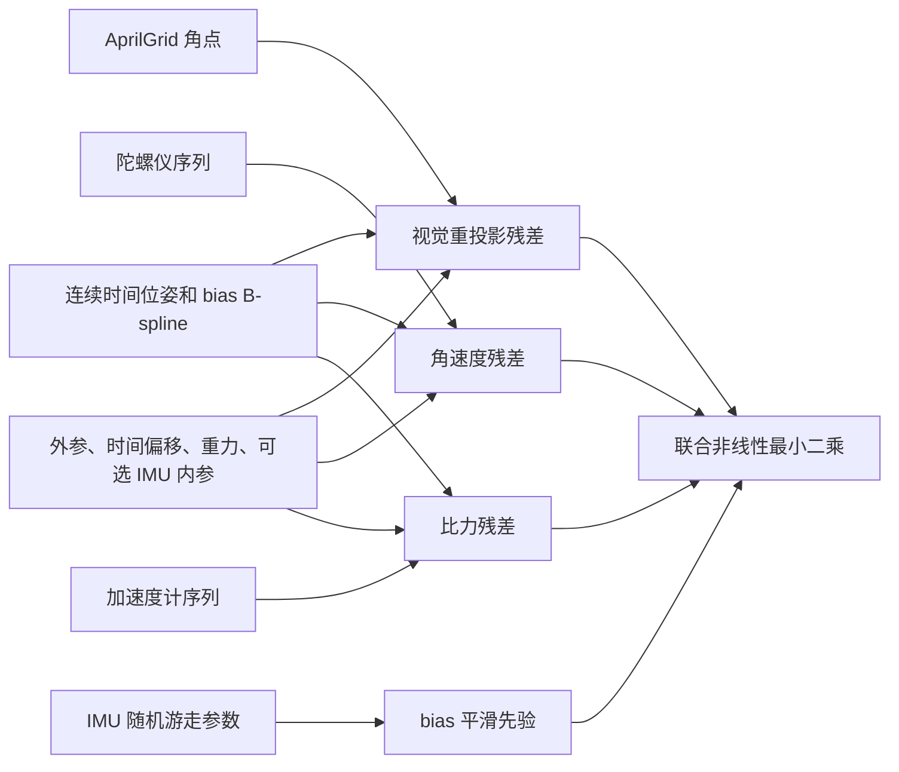
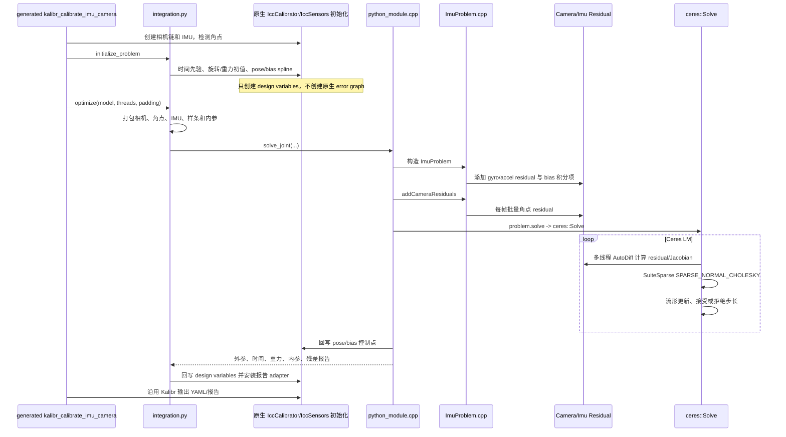

# IMU－相机联合标定深度解析：原生 Kalibr 与当前 Ceres 版本

本文面向希望从源码和数学原理两条线同时理解 `kalibr_calibrate_imu_camera` 的读者。讨论对象是：

- 原生 Kalibr 的 ASLAM 优化后端；
- 本仓库 `opt/ceres` 分支中的 Ceres 联合优化后端；
- 单目或已知相机链内参、双目基线以后，如何联合估计 IMU－相机外参、时间偏移、连续轨迹、IMU bias、重力方向，以及可选 IMU 内参。

这里不讨论相机内参/双目基线本身如何由 `kalibr_calibrate_cameras` 标定。进入 IMU－相机联合标定时，相机内参和默认的相机链基线已经由 camchain YAML 给出；联合问题主要利用这些已知相机参数约束 IMU 和相机之间的时空关系。

阅读导航：1～3 节先建立问题和状态量；4～9 节推导连续时间样条、初始化、视觉/IMU residual 和 LM；10～12 节逐项对照两套源码；13～14 节给出阅读、调试和运行方法；15 节总结边界与结论。

---

## 1. 先建立整体认识

IMU 和相机的采样机制完全不同：

- 相机在离散时刻看到标定板角点，提供“某一时刻传感器位姿”的几何约束；
- 陀螺仪高频测量角速度；
- 加速度计高频测量比力，即线加速度减重力后再旋转到传感器坐标系的结果；
- 两个传感器的时钟可能存在常量偏移；
- IMU 测量还包含随时间缓慢变化的 bias，以及可选的 scale、misalignment、g-sensitivity 和 size-effect。

Kalibr 的核心做法不是先分别计算两条轨迹再对齐，而是构造一条连续时间位姿 B-spline：

$$
\mathbf T_{wi}(t)=
\begin{bmatrix}
\mathbf C_{wi}(t)&\mathbf p_{wi}(t)\\
\mathbf 0^T&1
\end{bmatrix},
$$

让相机重投影、陀螺仪、加速度计在各自的真实采样时刻查询同一条轨迹，并在一个非线性最小二乘问题中共同调整轨迹和标定参数。

这可以概括为：



为什么必须联合优化：外参旋转会改变相机推导的角速度怎样对应陀螺仪；时间偏移会改变相机观测查询轨迹的位置；重力、轨迹二阶导数和加速度 bias 会共同影响加速度计预测。它们彼此耦合，分开求解只能作为初值，不能替代最终联合估计。

---

## 2. 坐标系和变换约定

本文统一使用以下下标：

- $w$：标定板/世界坐标系。Kalibr 把标定板固定，因此可用标定板坐标作为世界坐标；
- $i$ 或 $b$：参考 IMU/body 坐标系；单 IMU 时二者重合；
- $c_0$：第 0 个相机；
- $c_n$：相机链中的第 $n$ 个相机。

记 $\mathbf T_{ab}$ 为把 $b$ 系坐标变换到 $a$ 系：

$$
\mathbf p_a=\mathbf C_{ab}\mathbf p_b+\mathbf t_{ab}.
$$

位姿样条保存的是 $\mathbf T_{wi}(t)$，即 IMU 到世界的变换。因此：

$$
\mathbf p_i=\mathbf C_{wi}(t)^T
\left(\mathbf P_w-\mathbf p_{wi}(t)\right).
$$

第 0 个相机外参是 $\mathbf T_{c_0i}$。若相机链基线已知，记 $\mathbf T_{c_nc_0}$ 为 cam0 到 camN 的累计变换，则：

$$
\mathbf p_{c_n}
=\mathbf T_{c_nc_0}\mathbf T_{c_0i}
\mathbf T_{iw}(t)\mathbf P_w.
$$

这正是原生代码 `T_c_w = T_cN_b * T_b_w` 和 Ceres 代码 `point_imu -> point_camera0 -> point_camera` 表达的同一条变换链。

时间约定尤其重要。每个相机使用：

$$
t_i=t_c+\Delta t_{c\rightarrow i}^{\text{prior}}
+\delta t_c,
$$

其中：

- $\Delta t^{\text{prior}}$ 是互相关得到的粗略偏移；
- $\delta t_c$ 是联合优化中的小修正；
- 输出的总偏移为二者之和；
- Kalibr 的文字约定是 `t_imu = t_cam + shift`。

如果时间偏移符号理解反了，外参和轨迹会尝试补偿时序错误，通常表现为重投影尚可、IMU 残差很差或外参明显不合理。

---

## 3. 优化状态量

令所有待估参数组成 $\boldsymbol\theta$：

$$
\boldsymbol\theta=
\left\{
\begin{array}{l}
\mathbf c^p_0,\ldots,\mathbf c^p_{N_p-1},\\
\mathbf c^{b_g}_0,\ldots,\mathbf c^{b_g}_{N_g-1},\\
\mathbf c^{b_a}_0,\ldots,\mathbf c^{b_a}_{N_a-1},\\
\mathbf g_w,\ \mathbf T_{c_0i},\ \delta t_0,\ldots,\delta t_{N_c-1},\\
\boldsymbol\theta_{\text{imu,int}}
\end{array}
\right\}.
$$

各部分含义如下：

| 状态 | 维度/参数化 | 默认是否优化 | 作用 |
|---|---:|---:|---|
| 位姿样条控制点 $\mathbf c^p_k$ | 每点 6 维：平移 3 + rotation vector 3 | 是 | 连接相机和 IMU 的连续运动状态 |
| gyro bias 样条控制点 | 每点 3 维 | 是 | 描述慢变陀螺仪零偏 |
| accel bias 样条控制点 | 每点 3 维 | 是 | 描述慢变加速度计零偏 |
| 重力 $\mathbf g_w$ | 球面上 2 个局部自由度，长度固定 | 是 | 分离运动加速度和重力 |
| $\mathbf T_{c_0i}$ | 旋转 3 + 平移 3 局部自由度 | 是 | IMU－cam0 空间外参 |
| 每相机 $\delta t_c$ | 1 | 默认是 | 相机时间到 IMU 时间的细化 |
| 相机内参和畸变 | 已由 camchain 提供 | 否 | 联合标定中作为常量投影模型 |
| cam0 到其他相机的基线 | 已由 camchain 提供 | 默认否 | 保持先前双目标定结果；原生可请求重算 |
| IMU 内参 | 依模型而定 | 非 `calibrated` 时是 | scale/misalignment/size-effect |

当前 Ceres CLI 桥接只支持一个参考 IMU；原生 Kalibr 可以注册多个 IMU。当前 Ceres 联合路径也明确拒绝 `--recompute-chain-extrinsics`，所以双目基线固定，只有公共的 IMU－cam0 外参被联合优化。

### 3.1 三种 IMU 模型的附加状态

`calibrated` 假定 IMU 已完成内参标定，除 bias 外没有额外活动内参。

`scale-misalignment` 增加：

- 加速度计下三角矩阵 $\mathbf M_a$：6 自由度；
- 陀螺仪下三角矩阵 $\mathbf M_g$：6 自由度；
- IMU 轴到 gyro 轴旋转 $\mathbf C_{gi}$：3 局部自由度；
- 加速度对陀螺仪的敏感矩阵 $\mathbf A$：完整 3×3，共 9 自由度。

下三角形式为：

$$
\mathbf M=
\begin{bmatrix}
m_{00}&0&0\\
m_{10}&m_{11}&0\\
m_{20}&m_{21}&m_{22}
\end{bmatrix}.
$$

使用三角矩阵是为了消除“旋转”和“一般 3×3 校正矩阵”之间的重复参数化。若允许一个完整矩阵再同时估计坐标系旋转，同一种物理映射可由多组参数表示，问题会出现 gauge/秩亏。

`scale-misalignment-size-effect` 再增加三个加速度计轴的等效作用点：

$$
\mathbf r_x,\ \mathbf r_y,\ \mathbf r_z\in\mathbb R^3.
$$

原生和 Ceres 都固定 $\mathbf r_x=\mathbf 0$，只优化 $\mathbf r_y,\mathbf r_z$。这是选定一个参考点来消除三个作用点整体平移造成的不可辨识自由度。

---

## 4. 连续时间 B-spline

### 4.1 为什么不用离散位姿

相机常见采样率约几十 Hz，IMU 常见为数百 Hz，而且时间戳并不对齐。若每帧只保存一个位姿：

- IMU 时刻的姿态、角速度和加速度需要另外插值；
- 普通插值难以同时保证二阶可导；
- 时间偏移变化后，所有查询时刻都会移动，离散状态很难保持一致的导数。

B-spline 在任意时刻可直接求 $\mathbf x(t),\dot{\mathbf x}(t),\ddot{\mathbf x}(t)$，而且具有局部支撑：一个时刻只依赖相邻 $k$ 个控制点，因而雅可比和法方程保持稀疏。

### 4.2 基函数及导数

对阶数为 $k$ 的样条，在一个 knot segment 内令：

$$
u=\frac{t-t_s}{h_s},\qquad 0\le u<1,
$$

其中 $h_s=t_{s+1}-t_s$。定义幂向量：

$$
\mathbf u=[1,u,u^2,\ldots,u^{k-1}]^T.
$$

该段的基函数权重可写成：

$$
\mathbf B_s(u)=\mathbf M_s^T\mathbf u,
$$

$\mathbf M_s$ 是 Kalibr `BSpline` 为这一段生成的局部 basis matrix。曲线为：

$$
\mathbf x(t)=\sum_{j=0}^{k-1}B_{s,j}(u)\mathbf c_{s-k+1+j}.
$$

第 $d$ 阶时间导数为：

$$
\frac{d^d\mathbf x}{dt^d}
=\sum_j\frac{d^dB_{s,j}}{dt^d}\mathbf c_j,
$$

而幂项满足：

$$
\frac{d^d u^q}{dt^d}
=\frac{q!}{(q-d)!}\frac{u^{q-d}}{h_s^d},\qquad q\ge d.
$$

当前配置使用 `splineOrder=6`、`poseKnotsPerSecond=100`、`biasKnotsPerSecond=50`。因此每个测量通常只连接 6 个位姿控制点、6 个 gyro bias 控制点和 6 个 accel bias 控制点，而不是连接整条轨迹。

### 4.3 位姿样条的旋转表示

位姿曲线值是：

$$
\mathbf x_p(t)=
\begin{bmatrix}
\mathbf p_{wi}(t)\\
\mathbf r(t)
\end{bmatrix}\in\mathbb R^6.
$$

Kalibr 的 `sm::kinematics::RotationVector` 采用：

$$
\mathbf C_{wi}(\mathbf r)=\operatorname{Exp}(-[\mathbf r]_\times).
$$

Rodrigues 展开为：

$$
\mathbf C(\mathbf r)=\mathbf I
-\frac{\sin\theta}{\theta}[\mathbf r]_\times
+\frac{1-\cos\theta}{\theta^2}[\mathbf r]^2_\times,
\qquad \theta=\|\mathbf r\|.
$$

注意这里的负号。若按常见的 $\operatorname{Exp}(+[\mathbf r]_\times)$ 重写，旋转和角速度方向都会错。Ceres 版 `rotationVectorToMatrix()` 特意复制了这个约定。

Kalibr 定义一个映射矩阵 $\mathbf S(\mathbf r)$，令 body-frame 角速度为：

$$
\boldsymbol\omega_i(t)
=-\mathbf C_{wi}(t)^T\mathbf S(\mathbf r(t))\dot{\mathbf r}(t).
$$

当前 Ceres 版 `rotationVectorSMatrix()` 和 `angularVelocityBody()` 与原生 `BSplinePose::angularVelocityBodyFrame()` 使用相同公式。因此即使内部姿态不是 quaternion spline，两边由 rotation-vector spline 得到的角速度仍保持一致。

### 4.4 rotation vector 连续化

同一旋转可由相差 $2\pi$ 的 rotation vector 表示。初始化时原生 `initPoseSplineFromCamera()` 会在每个相机位姿附近搜索：

$$
\mathbf r_s=\mathbf a(\theta+2\pi s),\qquad s\in[-3,3],
$$

选取与前一个 rotation vector 欧氏距离最小的表示。否则曲线会在 $\pi$ 边界跳变，样条导数产生虚假的巨大角速度。Ceres 版本直接复用这段原生初始化，所以没有丢失该处理。

---

## 5. 初始化链路

非线性问题高度耦合，必须先落入正确吸引域。原生和当前 Ceres 使用同一套初始化。

### 5.1 角点与每帧标定板位姿

AprilGrid 检测得到：

- 图像角点 $\mathbf z_{cnj}$；
- 对应的标定板三维点 $\mathbf P_{wj}$；
- 利用已知相机内参求出的每帧 target－camera 位姿。

由相机观测位姿和当前 IMU－相机外参初值，生成离散的 $\mathbf T_{wi}(t)$ 样本，再用稀疏拟合初始化位姿样条。拟合正则参数为 `1e-4`，两端各增加 `2 * timeOffsetPadding` 的常值样本，保证后续时间偏移变化时仍可查询轨迹。

### 5.2 时间偏移粗估计

刚体上不同位置的角速度相同，且旋转坐标系不会改变向量范数。因此先比较：

$$
s_c(t)=\|\boldsymbol\omega_{\text{camera spline}}(t)\|,
\qquad
s_i(t)=\|\boldsymbol\omega_{\text{imu}}(t)\|.
$$

对两序列做 full cross-correlation：

$$
R_{ci}[\ell]=\sum_n s_c[n+\ell]s_i[n].
$$

取最大相关位置 $\ell^*$，以 IMU 平均采样周期 $\overline{\Delta t_i}$ 转换成：

$$
\Delta t^{\text{prior}}=-\ell^*\overline{\Delta t_i}.
$$

使用范数的好处是此时尚不知道相机到 IMU 的旋转；缺点是只能达到离散 IMU 周期附近的精度，而且角速度变化不充分时相关峰不明显。因此它只是粗初值，最终 $\delta t_c$ 仍进入联合优化。

### 5.3 外参旋转和 gyro bias 初值

固定视觉位姿样条，暂时只优化相机－IMU 旋转和一个常量 gyro bias：

$$
\min_{\mathbf C_{ic},\mathbf b_g}
\sum_k
\left\|
\mathbf L_g
\left(\mathbf C_{ic}\boldsymbol\omega_c(t_k)
+\mathbf b_g-\tilde{\boldsymbol\omega}_k\right)
\right\|^2.
$$

这给联合问题提供外参旋转初值，同时得到 `GyroBiasPrior`。这个阶段只使用旋转运动，因为 gyro 不受重力和外参平移影响，问题比完整联合优化稳定。

### 5.4 重力方向初值

利用初步外参把加速度计测量转到世界系，对低频/平均分量估计重力方向，再归一化到：

$$
\|\mathbf g_w\|=9.80655\ \mathrm{m/s^2}.
$$

最终优化只允许重力方向在球面上变化，不允许长度任意变化。否则重力长度、加速度计 scale 和轨迹加速度之间会产生更强相关性。

### 5.5 bias 样条

gyro bias 样条初始化为前面估计的常量 bias，加速度 bias 初始化为零：

$$
\mathbf b_g(t)\leftarrow\mathbf b_g^{\text{prior}},
\qquad
\mathbf b_a(t)\leftarrow\mathbf 0.
$$

随后通过 IMU 残差和随机游走先验共同修正。

---

## 6. 相机重投影残差

对相机 $c_n$ 在相机时间 $t_c$ 看到的第 $j$ 个标定板点：

$$
t=t_c+\Delta t_n^{\text{prior}}+\delta t_n.
$$

点经过以下变换：

$$
\mathbf p_i
=\mathbf C_{wi}(t)^T(\mathbf P_{wj}-\mathbf p_{wi}(t)),
$$

$$
\mathbf p_{c_0}=\mathbf C_{c_0i}\mathbf p_i+\mathbf t_{c_0i},
$$

$$
\mathbf p_{c_n}=\mathbf C_{c_nc_0}\mathbf p_{c_0}+\mathbf t_{c_nc_0}.
$$

对针孔模型，归一化坐标：

$$
x=X/Z,\qquad y=Y/Z,\qquad r^2=x^2+y^2.
$$

4 参数 radtan：

$$
L(r)=1+k_1r^2+k_2r^4,
$$

5 参数 OpenCV radtan 增加：

$$
L(r)=1+k_1r^2+k_2r^4+k_3r^6.
$$

切向畸变和像素投影为：

$$
x_d=xL(r)+2p_1xy+p_2(r^2+2x^2),
$$

$$
y_d=yL(r)+p_1(r^2+2y^2)+2p_2xy,
$$

$$
\hat{\mathbf z}=
\begin{bmatrix}
f_ux_d+c_u\\f_vy_d+c_v
\end{bmatrix}.
$$

原始误差和白化误差分别为：

$$
\mathbf e_{c,nj}=\hat{\mathbf z}_{nj}-\mathbf z_{nj},
\qquad
\mathbf r_{c,nj}=\mathbf L_{c,nj}\mathbf e_{c,nj},
$$

其中 $\mathbf L^T\mathbf L=\boldsymbol\Sigma_c^{-1}$，默认角点标准差为 1 px。

为什么相机残差能标定外参：改变 $\mathbf T_{c_0i}$ 会改变所有时刻、所有角点的投影。外参只有一组全局参数，而轨迹还必须同时解释 IMU 测量，所以不能任意用轨迹吸收外参误差。

### 6.1 时间偏移如何被优化

因为轨迹在 $t=t_c+\Delta t+\delta t$ 处求值，链式法则给出：

$$
\frac{\partial\mathbf r_c}{\partial\delta t}
=\frac{\partial\mathbf r_c}{\partial\mathbf T}
\frac{\partial\mathbf T(t)}{\partial t}
\frac{\partial t}{\partial\delta t}
=\frac{\partial\mathbf r_c}{\partial\mathbf T}
\frac{\partial\mathbf T(t)}{\partial t}.
$$

所以时间偏移可观测性的本质是运动：若相机静止，$\partial\mathbf T/\partial t\approx0$，改变时间几乎不改变投影，时间偏移就不可观。需要包含足够角运动和线运动的数据。

原生 Kalibr 用 `Scalar` expression 作为时间设计变量，`transformationAtTime()` 在 expression graph 中传播导数。Ceres 版使用标量 parameter block；`DynamicSpline::evaluateParameters()` 接受 `ceres::Jet` 时间，因此 AutoDiff 会沿同一链式法则求 $\partial\mathbf r/\partial\delta t$。

因为时间偏移会让一个观测跨越 knot segment，Ceres 建图时预先把 $[t-\epsilon,t+\epsilon]$ 内可能涉及的控制点都挂到 residual block，并把：

$$
-\epsilon\le\delta t\le\epsilon,
\qquad \epsilon=\texttt{timeOffsetPadding}=0.03\ \mathrm{s}
$$

设置为参数上下界。这既保持图结构固定，也避免求值超出样条定义域。

---

## 7. IMU 预测模型与残差推导

### 7.1 从刚体运动到加速度计比力

IMU 原点在世界系的位置为 $\mathbf p_{wi}(t)$，其世界系线加速度：

$$
\mathbf a_w(t)=\ddot{\mathbf p}_{wi}(t).
$$

理想加速度计不直接测 $\mathbf a_w$，而测比力：

$$
\mathbf f_i(t)=\mathbf C_{wi}(t)^T
\left(\mathbf a_w(t)-\mathbf g_w\right).
$$

为什么是减重力：静止时 $\mathbf a_w=0$。若世界重力向下，则传感器为了保持静止受到向上的支撑力，加速度计读数对应 $-\mathbf C^T\mathbf g$。Kalibr 的具体重力向量方向由初始化和坐标约定决定，但代码结构始终是 `C_b_w * (a_w - g_w)`。

### 7.2 刚体上偏心点的加速度

若一个感测点相对参考原点的固定杆臂为 $\mathbf r$，它的加速度为：

$$
\mathbf a(\mathbf r)=\mathbf a(\mathbf 0)
+\dot{\boldsymbol\omega}\times\mathbf r
+\boldsymbol\omega\times(\boldsymbol\omega\times\mathbf r).
$$

推导如下。世界系位置：

$$
\mathbf p_r=\mathbf p_0+\mathbf C\mathbf r.
$$

因为 $\mathbf r$ 在刚体中为常量，且
$\dot{\mathbf C}\mathbf r=\mathbf C(\boldsymbol\omega\times\mathbf r)$，第一次求导：

$$
\dot{\mathbf p}_r=\dot{\mathbf p}_0
+\mathbf C(\boldsymbol\omega\times\mathbf r).
$$

再次求导：

$$
\ddot{\mathbf p}_r=\ddot{\mathbf p}_0
+\mathbf C\left(
\dot{\boldsymbol\omega}\times\mathbf r
+\boldsymbol\omega\times(\boldsymbol\omega\times\mathbf r)
\right).
$$

前一项是切向加速度，后一项是向心/离心形式的旋转加速度。这就是 size-effect 只有在存在角加速度或较大角速度时才可辨识的原因。

原生 Kalibr 还支持多个 IMU。若 body spline 绑定在参考 IMU $b$，第 $m$ 个 IMU 与 body 之间存在旋转 $\mathbf C_{i_mb}$ 和杆臂 $\mathbf r_b$，则其一般式为：

$$
\boldsymbol\omega_{i_m}=\mathbf C_{i_mb}\boldsymbol\omega_b,
$$

$$
\mathbf f_{i_m}=\mathbf C_{i_mb}\left[
\mathbf C_{bw}(\mathbf a_w-\mathbf g_w)
+\dot{\boldsymbol\omega}_b\times\mathbf r_b
+\boldsymbol\omega_b\times(\boldsymbol\omega_b\times\mathbf r_b)
\right].
$$

原生 `IccImu.addAccelerometerErrorTerms()` 和 `addGyroscopeErrorTerms()` 保留了这套一般表达式。对参考 IMU，代码固定 $\mathbf C_{i_0b}=\mathbf I$、$\mathbf r_b=\mathbf0$，便退化为下面各节的公式。当前 Ceres CLI 只支持这个参考 IMU，所以 Ceres residual 直接采用退化后的形式；在其已支持范围内这是等价简化，并不等于多 IMU 功能也已迁移。

### 7.3 `calibrated` 模型

理想预测：

$$
\hat{\boldsymbol\omega}_k
=\boldsymbol\omega_i(t_k)+\mathbf b_g(t_k),
$$

$$
\hat{\mathbf a}_k
=\mathbf f_i(t_k)+\mathbf b_a(t_k).
$$

残差：

$$
\mathbf r_{g,k}=\mathbf L_g
\left(\hat{\boldsymbol\omega}_k-\tilde{\boldsymbol\omega}_k\right),
$$

$$
\mathbf r_{a,k}=\mathbf L_a
\left(\hat{\mathbf a}_k-\tilde{\mathbf a}_k\right).
$$

其中 $\mathbf L_g^T\mathbf L_g=\boldsymbol\Sigma_g^{-1}$，$\mathbf L_a^T\mathbf L_a=\boldsymbol\Sigma_a^{-1}$。原生 `EuclideanError` 明确使用 `prediction - measurement`，Ceres 保持相同符号；即使平方目标不受整体符号影响，保持符号仍有利于逐项比对 Jacobian 和报告。

### 7.4 `scale-misalignment` 模型

加速度计预测：

$$
\hat{\mathbf a}
=\mathbf M_a\mathbf f_i+\mathbf b_a.
$$

陀螺仪预测：

$$
\hat{\boldsymbol\omega}
=\mathbf M_g(\mathbf C_{gi}\boldsymbol\omega_i)
+\mathbf A(\mathbf C_{gi}\mathbf f_i)
+\mathbf b_g.
$$

各项物理意义：

- $\mathbf M_a,\mathbf M_g$：轴 scale 和非正交性；
- $\mathbf C_{gi}$：gyro 三轴坐标系相对参考 IMU/accelerometer 坐标的旋转；
- $\mathbf A$：加速度对 gyro 输出的线性耦合，即 g-sensitivity；
- bias spline：温漂等缓慢变化的加性误差。

为什么要有动态数据：静止时只能看到重力在少量方向的投影，scale、misalignment、重力方向和 bias 高度相关。充分旋转和线加速度使 $\boldsymbol\omega$ 与 $\mathbf f$ 覆盖多个方向，才能提高信息矩阵秩。

### 7.5 `scale-misalignment-size-effect` 模型

三个输出轴可以具有不同的有效感测位置。定义：

$$
\mathbf q(\mathbf r)=
\dot{\boldsymbol\omega}\times\mathbf r
+\boldsymbol\omega\times(\boldsymbol\omega\times\mathbf r).
$$

以选择矩阵：

$$
\mathbf I_x=\operatorname{diag}(1,0,0),\quad
\mathbf I_y=\operatorname{diag}(0,1,0),\quad
\mathbf I_z=\operatorname{diag}(0,0,1)
$$

组合出：

$$
\mathbf f_{\text{size}}
=\mathbf f_i
+\mathbf I_x\mathbf q(\mathbf r_x)
+\mathbf I_y\mathbf q(\mathbf r_y)
+\mathbf I_z\mathbf q(\mathbf r_z),
$$

$$
\hat{\mathbf a}=\mathbf M_a\mathbf f_{\text{size}}+\mathbf b_a.
$$

gyro 的 g-sensitivity 仍使用参考点比力 $\mathbf f_i$，与原生实现一致。

一个容易忽略的源码事实：原生 `BSplinePose::angularAccelerationBodyFrame()` 实际计算的是

$$
-\mathbf C^T\mathbf S(\mathbf r)\ddot{\mathbf r},
$$

并不是对
$-\mathbf C^T\mathbf S(\mathbf r)\dot{\mathbf r}$
进行完整时间求导后的所有项。当前 Ceres 版有意复制了这一实现，以保证与 Kalibr 基线一致。因此本文在解释物理原理时写作 $\dot{\boldsymbol\omega}$，但理解/对比代码时必须知道两边使用的是 Kalibr 的上述 rotation-vector 二阶导映射。

---

## 8. IMU 噪声、bias 随机游走和总代价函数

### 8.1 连续噪声密度到离散标准差

IMU YAML 给出 noise density $\sigma_c$ 和 update rate $f_s$。Kalibr 使用：

$$
\sigma_d=\frac{\sigma_c}{\sqrt{1/f_s}}
=\sigma_c\sqrt{f_s}.
$$

测量协方差通常为 $\boldsymbol\Sigma=\sigma_d^2\mathbf I$，信息矩阵为 $\boldsymbol\Sigma^{-1}$。当前 Ceres 桥接直接读取原生构造好的 `omegaInvR` 和 `alphaInvR`，因此没有重复或改变这一步离散化。

### 8.2 bias 随机游走先验

仅靠每个 IMU 样本拟合 bias，会允许 bias 高频摆动并吸收真实运动。假设 bias 是连续时间随机游走，对其一阶导数施加能量：

$$
E_b=\int_{t_0}^{t_1}
\dot{\mathbf b}(t)^T
\mathbf W_b
\dot{\mathbf b}(t)dt,
\qquad
\mathbf W_b=\frac{1}{\sigma_{rw}^2}\mathbf I.
$$

由于 B-spline 对控制点线性：

$$
\dot{\mathbf b}(t)=\dot{\mathbf B}(t)\mathbf c_b,
$$

代入得到：

$$
E_b
=\mathbf c_b^T
\left[
\int\dot{\mathbf B}(t)^T\mathbf W_b\dot{\mathbf B}(t)dt
\right]
\mathbf c_b
=\mathbf c_b^T\mathbf Q_b\mathbf c_b.
$$

若分解 $\mathbf Q_b=\mathbf R_b^T\mathbf R_b$，则可写成标准最小二乘 residual：

$$
E_b=\|\mathbf R_b\mathbf c_b\|^2.
$$

原生 `BSplineEuclideanMotionError` 直接以 $\mathbf c^T\mathbf Q\mathbf c$ 构造 Hessian。Ceres 版调用 Kalibr 自己的 `segmentIntegral(..., derivative=1)` 得到每段精确因子，再由 `SplineSegmentMotionCost` 返回 $\mathbf R\mathbf c$。这不是 8 点数值积分近似；当前实现与原生的二次积分能量等价。

### 8.3 完整目标

无 robust loss 时，原生 Kalibr 最小化：

$$
J(\boldsymbol\theta)=
\sum_{n,j}\|\mathbf r_{c,nj}\|^2
+\sum_k\|\mathbf r_{g,k}\|^2
+\sum_k\|\mathbf r_{a,k}\|^2
+E_{b_g}+E_{b_a}.
$$

Ceres 报告的 `cost` 定义为：

$$
F(\boldsymbol\theta)=\frac12J(\boldsymbol\theta).
$$

因此对比原生总 error 和 Ceres `initial_cost/final_cost` 时必须使用 `2 * Ceres cost`。若忘记这个 $1/2$，会错误地认为两边残差差了一倍。

CLI 默认 `blakeZisserCam=-1`、`huberAccel=-1`、`huberGyro=-1`，即联合标定默认没有 robust loss。Ceres 实现保留了 IMU Huber 接口，但默认同样关闭；相机 Blake-Zisserman 在当前 Ceres 联合路径不支持。

---

## 9. 非线性优化如何迭代

### 9.1 一阶线性化

对当前状态 $\boldsymbol\theta$，采用适合流形的局部增量 $\delta$：

$$
\mathbf r(\boldsymbol\theta\boxplus\delta)
\approx\mathbf r(\boldsymbol\theta)+\mathbf J\delta.
$$

高斯－牛顿子问题为：

$$
\min_\delta\frac12\|\mathbf r+\mathbf J\delta\|^2.
$$

令梯度 $\mathbf g=\mathbf J^T\mathbf r$，近似 Hessian $\mathbf H=\mathbf J^T\mathbf J$，得到法方程：

$$
\mathbf H\delta=-\mathbf g.
$$

由于问题非线性且初值不完美，直接高斯－牛顿可能步长过大。Levenberg－Marquardt 加入阻尼：

$$
(\mathbf H+\lambda\mathbf D)\delta=-\mathbf g.
$$

大 $\lambda$ 时更接近保守的梯度下降，小 $\lambda$ 时更接近快速的高斯－牛顿。

### 9.2 为什么需要流形

旋转 quaternion 有 4 个数但只有 3 个自由度，直接在 $\mathbb R^4$ 更新会破坏单位长度。重力是 3 个数但长度固定，也只有 2 个局部自由度。

原生使用 `RotationQuaternionDv` 和 `EuclideanDirection`；Ceres 使用：

- `ceres::QuaternionManifold`：更新 IMU 内参旋转和 $\mathbf T_{c_0i}$ 的旋转；
- `ceres::SphereManifold<3>`：更新重力方向。

两边都是在局部切空间计算增量，再 retract 回合法流形。这样既保持物理约束，也避免引入一个无效自由度导致法方程病态。

### 9.3 可观测性和 gauge

联合问题中常见的相关性：

- 时间偏移与外参旋转：近似恒定角速度时，时间平移可近似成额外旋转；
- 重力方向、accel bias 和线加速度；
- 外参平移与弱线加速数据；
- IMU scale/misalignment 与轨迹导数；
- size-effect 与高频 bias/噪声。

Kalibr 通过固定标定板世界系、固定重力长度、限制 IMU 内参矩阵结构、固定 size-effect 的 $\mathbf r_x$、使用 bias 随机游走先验以及要求充分激励来去除或缓解这些退化。优化器本身不能从没有信息的数据中“算出”不可观参数。

---

## 10. 原生 Kalibr 的调用与优化过程

### 10.1 主调用链

```mermaid
sequenceDiagram
    participant CLI as kalibr_calibrate_imu_camera
    participant Sensor as IccSensors.py
    participant Cal as IccCalibrator.py
    participant Spline as BSpline/BSplinePose
    participant Graph as CalibrationOptimizationProblem
    participant Opt as Optimizer2
    participant Lin as BlockCholeskyLinearSystemSolver

    CLI->>Sensor: 创建 IccImu / 内参模型
    CLI->>Sensor: 创建 IccCameraChain，读取数据并检测角点
    CLI->>Cal: registerCamChain / registerImu
    CLI->>Cal: buildProblem(order=6, pose=100Hz, bias=50Hz)
    Cal->>Sensor: findTimeshiftCameraImuPrior
    Cal->>Sensor: findOrientationPriorCameraChainToImu
    Cal->>Sensor: initializePoseSplineFromCameraChain
    Sensor->>Spline: initPoseSplineSparse
    Cal->>Sensor: initBiasSplines
    Cal->>Graph: initDesignVariables
    Cal->>Sensor: addCameraChainErrorTerms
    Cal->>Sensor: addAccelerometerErrorTerms
    Cal->>Sensor: addGyroscopeErrorTerms
    Cal->>Sensor: addBiasMotionTerms
    CLI->>Cal: optimize
    Cal->>Opt: setProblem + optimize
    loop LM iteration
        Opt->>Graph: evaluate errors / Jacobians
        Opt->>Lin: build sparse block normal equation
        Lin-->>Opt: solve delta
        Opt->>Graph: apply/revert design-variable update
    end
    CLI->>Cal: print/save camchain + IMU YAML
```

### 10.2 文件与函数定位

| 阶段 | 文件 | 函数/类 | 功能 |
|---|---|---|---|
| CLI 参数和模型选择 | `upstream/.../kalibr/python/kalibr_calibrate_imu_camera` | `main()` | 选择 3 种 IMU 模型、设定 6/100/50 等参数、构建和求解 |
| 联合问题编排 | `.../kalibr_imu_camera_calibration/IccCalibrator.py` | `buildProblem()` | 按顺序初始化并添加所有 residual |
| 状态注册 | 同上 | `initDesignVariables()` | 位姿、重力、IMU、相机参数加入优化问题 |
| 最终求解 | 同上 | `optimize()` | 配置 `Optimizer2`、LM 和 Block Cholesky |
| 时间初值 | `.../IccSensors.py` | `findTimeshiftCameraImuPrior()` | 角速度范数互相关 |
| 外参旋转初值 | 同上 | `findOrientationPriorCameraToImu()` | 视觉角速度对齐 gyro，并估常量 bias |
| 位姿样条初值 | 同上 | `initPoseSplineFromCamera()` | 每帧位姿、rotation vector unwrap、稀疏 spline fit |
| 相机 residual | 同上 | `addCameraErrorTerms()` | 动态时刻变换链和逐角点重投影项 |
| IMU residual | 同上 | 三种 `addAccelerometerErrorTerms()` / `addGyroscopeErrorTerms()` | 三种 IMU 预测模型 |
| bias 先验 | 同上 | `addBiasMotionTerms()` | 一阶导连续积分 |
| 误差符号 | `upstream/.../kalibr/src/EuclideanError.cpp` | `evaluateErrorImplementation()` | `prediction - measurement` 和 Mahalanobis 能量 |
| 角运动学 | `upstream/.../bsplines/src/BSplinePose.cpp` | `angularVelocityBodyFrame()` | rotation-vector 导数到 body gyro |
| bias 二次项 | `upstream/.../aslam_splines/.../BSplineMotionError.hpp` | `evaluateErrorImplementation()` / `buildHessianImplementation()` | 直接注入 $c^TQc$ 的 Hessian/右端 |
| LM 策略 | `upstream/.../aslam_backend/src/LevenbergMarquardtTrustRegionPolicy.cpp` | `solveSystemImplementation()` | 根据 gain ratio 调整 $\lambda$ 并支持回滚 |
| 稀疏线性解 | `upstream/.../aslam_backend/src/BlockCholeskyLinearSystemSolver.cpp` | `buildSystem()` / `solveSystem()` | block sparse Cholesky |

### 10.3 原生 LM 的具体配置

`IccCalibrator.optimize()` 设置：

- 初始 $\lambda=10$；
- `convergenceDeltaX=1e-5`；
- `convergenceDeltaJ=1e-2`；
- 默认 `maxIterations=30`；
- `nThreads=CPU数-1`；
- `BlockCholeskyLinearSystemSolver`。

LM 用实际下降和线性模型预测下降的比率：

$$
\rho=\frac{J(\theta)-J(\theta\boxplus\delta)}
{\delta^T(\lambda\delta+\mathbf b)},
$$

判断当前步是否可信。失败时回滚设计变量并放大 $\lambda$，成功时重建系统并减小阻尼。

需要注意：虽然 `Optimizer2` 的误差/Jacobian 计算可使用线程参数，源码注释明确指出这里的 `BlockCholeskyLinearSystemSolver` 本身没有多线程支持。因此最昂贵的稀疏分解不能充分利用现代多核。

---

## 11. 当前 Ceres 版本的调用与优化过程

安装后的 CLI 由顶层 `CMakeLists.txt` 在生成脚本时注入 `--optimizer {native,ceres}`。选择 `--optimizer ceres` 后，不调用原生 `buildProblem()`，而是保留其初始化，再把数据和初值交给 Ceres。



### 11.1 文件与函数定位

| 层 | 文件 | 函数/类 | 功能 |
|---|---|---|---|
| CLI 接入 | `CMakeLists.txt` | 生成脚本的 patch 片段 | 注入 `--optimizer ceres`、选择初始化/求解路径 |
| Python 初始化 | `extensions/ceres_optimizer/python/kalibr_ceres_optimizer/integration.py` | `initialize_problem()` | 复用原生初始化但不创建原生 residual graph |
| 数据转换 | 同上 | `_camera_data()`、`_corners()`、`_imu_data()`、`_intrinsics()` | 将 Python/ASLAM 对象变成紧凑矩阵 |
| 求解入口 | 同上 | `optimize()` | 调用 C++ 并回写结果、构造报告适配器 |
| Python/C++ ABI | `extensions/ceres_optimizer/src/python_module.cpp` | `solveJoint()` | 解包模型，构造 `ImuProblem`、相机 residual，调用 solve |
| 问题图 | `extensions/ceres_optimizer/src/ImuProblem.cpp` | 构造函数、`addCameraResiduals()`、`solve()` | 参数块、流形、上下界、残差图和结果 |
| IMU 方程 | `extensions/ceres_optimizer/include/kalibr/ceres_optimizer/ImuResidual.hpp` | `predictImuMeasurement()`、`ImuResidual` | 三种模型、白化误差、AutoDiff functor |
| 相机方程 | `.../CameraResidual.hpp` | `CameraObservationResidual` | 每帧共享一次样条/旋转计算，输出所有角点 residual |
| 动态时间样条 | `.../DynamicSpline.hpp` | `evaluateParameters()` | 原生 basis matrix + Jet 时间导数 |
| bias 先验 | `.../SplineMotionCost.cpp` | `SplineSegmentMotionCost::Evaluate()` | 精确积分因子的 residual 和常量 Jacobian |
| 求解器 | `extensions/ceres_optimizer/src/Backend.cpp` | `makeSolverOptions()`、`solve()` | LM、SuiteSparse、线程数和摘要 |

### 11.2 Ceres 参数块和 residual 批处理

一个 IMU 测量在 6 阶样条下连接：

- 6 个 pose 控制点，每个 6 维；
- 6 个 gyro bias 控制点，每个 3 维；
- 6 个 accel bias 控制点，每个 3 维；
- 重力；
- 可选 IMU 内参块。

无 Huber 时，相邻且共享同一组控制点的 IMU 测量可放进一个 `ImuBatchResidual`；相机则把同一图像中的所有角点放进一个 `CameraObservationResidual`。批处理不改变：

$$
\sum_j\|\mathbf r_j\|^2,
$$

只避免重复计算相同时间的 spline、旋转和参数块元数据。若每个样本需要单独 robust loss，就不能随意合并，因为：

$$
\rho\left(\sum_j\|r_j\|^2\right)
\ne\sum_j\rho(\|r_j\|^2).
$$

所以当前代码在 Huber 开启时保持独立 IMU residual，以维持 robust 统计意义。

### 11.3 Ceres 求解配置

联合问题配置：

- `LEVENBERG_MARQUARDT`；
- `SPARSE_NORMAL_CHOLESKY`；
- `SUITE_SPARSE`；
- `num_threads` 由 `--ceres-threads` 指定，0 时取 CPU 数减一；
- 最大迭代次数与 CLI `--max-iter` 对齐。

Ceres 可并行 residual/Jacobian 计算，并让 SuiteSparse 使用其可用的稀疏实现。独立相机 bundle adjustment 使用 `SPARSE_SCHUR`，但 IMU－相机联合问题包含强时间链式连接的 spline 控制点，不是标准“相机－独立路标”二部图，因此采用 `SPARSE_NORMAL_CHOLESKY` 更直接。

当前 `Backend.cpp` 没有显式覆盖 Ceres 的 function/gradient/parameter tolerance，也没有把原生初始 $\lambda=10$ 映射成 Ceres 的初始 trust-region 配置。因此“最大迭代次数和数学目标对齐”不等于“逐迭代路径完全相同”。这是两边最终数值出现小差异的主要正常来源之一。

---

## 12. 两个后端到底相同和不同在哪里

| 项目 | 原生 Kalibr | 当前 Ceres | 结论/影响 |
|---|---|---|---|
| 数据读取和角点 | 当前 no-ROS 数据接口 + 原生上层对象 | 相同 | 输入点一致 |
| 时间偏移粗初值 | gyro norm 互相关 | 复用原生 | 相同 |
| 外参旋转/重力初值 | 原生短优化和计算 | 复用原生 | 相同 |
| 位姿/bias spline 初值 | 原生 BSpline | 复用原生 | 相同 |
| spline 阶数/密度 | 6 / 100 Hz / 50 Hz | 相同 | 相同 |
| spline basis | Kalibr BSpline | 复制同一 knot 和 basis matrix | 数学相同 |
| 相机残差 | ASLAM expression/keypoint error | Ceres AutoDiff functor | 方程和权重相同，组织不同 |
| IMU 残差 | ASLAM expression + `EuclideanError` | Ceres AutoDiff | 三种预测方程和符号相同 |
| bias motion | 全局 $c^TQc$ 特殊 error term | 按 segment 的 $Rc$ residual | 总二次能量相同 |
| 重力约束 | `EuclideanDirection` | `SphereManifold<3>` | 都固定长度、优化方向 |
| 时间变量 | ASLAM scalar DV | 每相机 1 维 parameter block + bounds | 物理量相同；Ceres 显式限制 ±padding |
| 外参旋转 | ASLAM rotation DV | quaternion + manifold | 局部自由度相同 |
| Jacobian | ASLAM expression analytic chain | Ceres AutoDiff Jet | 理论导数相同，浮点舍入/实现路径不同 |
| residual 粒度 | 多为每角点/每 IMU 样本一项 | 同帧角点、相邻 IMU 可批处理 | 目标不变，减少开销 |
| LM 细节 | 初始 λ=10、Kalibr gain policy | Ceres 默认 trust-region 参数 | 迭代轨迹和停止点可不同 |
| 线性解 | Block Cholesky | SuiteSparse sparse normal Cholesky | 稀疏排序、舍入和性能不同 |
| 多线程 | 线性 solver 注释为不支持 | residual/Jacobian 多线程 | Ceres 的主要性能动机 |
| 相机链基线 | 默认固定，可请求重算 | 固定，拒绝重算 | 默认工作流一致，扩展能力未齐 |
| 多 IMU | 支持 | 当前只支持 1 个参考 IMU | 功能差异 |
| 协方差恢复 | 支持 `--recover-covariance` | 尚未接通 | 功能差异 |
| 相机模型 | 原生模型集合更多 | 联合路径仅 pinhole-radtan4/5 | 功能差异 |
| 输出 | 原生 YAML/报告 | 回写原生对象后沿用输出 | 输出格式尽量一致 |

### 12.1 为什么结果不要求逐位相同

即使 residual 在同一点完全相同，以下差异也会使最终参数略有区别：

1. Jacobian 的表达式求导与 AutoDiff 运算顺序不同；
2. 稀疏矩阵排序和 Cholesky 分解顺序不同；
3. 多线程归约的浮点加法顺序不同；
4. LM 阻尼更新策略和停止条件不同；
5. 非线性问题可能存在平坦方向，微小数值扰动会沿弱可观方向产生较大参数变化。

正确的对齐标准应是：

- 相同初值处，各类 raw/normalized residual 和总能量一致；
- 优化后 cost 明显下降，且终态 residual 稳定；
- 外参、时间偏移、重力和 IMU 内参在物理合理范围；
- 以原生结果为基准的旋转、平移、时间和内参差异在任务容许范围；
- 更换数据集后仍收敛，而不是依赖特定数据的硬编码。

不能只看 Ceres 的 `CONVERGENCE` 字样。达到最大迭代次数但 cost 持续下降、解可用，和数值发散是两种完全不同的状态；反之，因参数步长很小而停止也不保证数据具有充分可观测性。

---

## 13. 如何按源码深入阅读

推荐按下面顺序，而不是从求解器底层开始：

1. 先读 `IccCalibrator.buildProblem()`，把初始化、状态和四类 residual 的顺序画出来；
2. 读 `IccSensors.py` 的 `findTimeshift...`、`findOrientationPrior...` 和 `initPoseSplineFromCamera()`，理解初值从何而来；
3. 手算一条相机点的 $P_w\rightarrow p_i\rightarrow p_{c0}\rightarrow p_{cn}\rightarrow z$；
4. 手算一个 IMU 时刻的 $p,\dot p,\ddot p,r,\dot r\rightarrow\omega,f\rightarrow residual$；
5. 再读三种 IMU 模型，逐项对应 $M_a,C_{gi},M_g,A,r_x,r_y,r_z$；
6. 最后比较 ASLAM error graph 与 Ceres parameter/residual block 的组织方式；
7. 进入 `Optimizer2` 和 `ceres::Solve`，理解相同目标怎样产生不同迭代路径。

### 13.1 建议设置的观测点/断点

原生路径可观察：

- `IccCalibrator.py: buildProblem()` 初始化结束后的重力、外参和 spline；
- `IccSensors.py: addCameraErrorTerms()` 的 `frameTime`、`T_c_w`；
- `IccSensors.py` 三种 IMU residual 的 `a`、`w`；
- `EuclideanError.cpp` 的 predicted、measurement 和 weighted squared error；
- `LevenbergMarquardtTrustRegionPolicy.cpp` 的 `rho`、`lambda`、回滚。

Ceres 路径可观察：

- `integration.py: optimize()` 打包前的同一组原生初值；
- `python_module.cpp: solveJoint()` 中模型展开和 options；
- `ImuResidual.hpp: predictImuMeasurement()` 的 `angular_velocity`、`body_origin_force`；
- `CameraResidual.hpp: CameraObservationResidual::operator()` 的 timestamp 和变换链；
- `Backend.cpp: solve()` 的 `initial_cost`、`final_cost`、iteration summary。

### 13.2 最小验证顺序

不要一开始只比较最终 YAML。建议分层检查：

1. **投影单元测试**：已知 3D 点和相机参数，检查 radtan4/5 投影；
2. **样条测试**：相同 controls/timestamp 下比较 0、1、2 阶值；
3. **IMU 预测测试**：三种模型下比较 prediction；
4. **bias 积分测试**：验证 $E_{native}=\|r_{ceres}\|^2$；
5. **零迭代对齐**：相同初始化处比较每类 residual，并使用 $J=2F$；
6. **短迭代对齐**：固定相同最大迭代数，确认两边 cost 都下降；
7. **完整数据收敛**：最后比较输出外参、时间和内参。

仓库现有相关测试包括：

- `extensions/ceres_optimizer/tests/imu_prediction_test.cpp`；
- `extensions/ceres_optimizer/tests/spline_motion_cost_test.cpp`；
- `extensions/ceres_optimizer/tests/imu_problem_test.cpp`；
- `extensions/ceres_optimizer/tests/joint_problem_test.cpp`；
- `extensions/ceres_optimizer/tests/backend_parallel_test.cpp`。

完整三方精度、时间和内存基线见 `docs/THREE_WAY_BENCHMARK_CN.md`；Ceres 后端的构建和使用说明见 `docs/CERES_OPTIMIZER_CN.md`。

---

## 14. 用当前工程实际运行和观察

以 EuRoC 双目 + IMU 数据为例，当前 Ceres 路径的核心命令形式为：

```bash
cd /home/czh/kalibr_workspace/my_code/kalibr_no_ros

env -u ROS_DISTRO -u ROS_ROOT -u ROS_PACKAGE_PATH \
  -u CMAKE_PREFIX_PATH -u PYTHONPATH MPLBACKEND=Agg \
  ./install/ceres/bin/kalibr_calibrate_imu_camera \
  --target /home/czh/kalibr_workspace/data/euroc_cam/april_6x6.yaml \
  --imu /home/czh/kalibr_workspace/data/euroc_cam/imu_adis16448.yaml \
  --imu-models calibrated \
  --cams /home/czh/kalibr_workspace/data/euroc_cam/cam_april-camchain.yaml \
  --bag /home/czh/kalibr_workspace/data/euroc_cam/imu_april.bag \
  --optimizer ceres --ceres-threads 0 \
  --dont-show-report
```

把 `--imu-models calibrated` 依次替换为：

```text
scale-misalignment
scale-misalignment-size-effect
```

即可观察活动 IMU 内参逐步增加后，收敛、耗时、内存和参数相关性的变化。

学习时建议保留日志中的：

- Before Optimization 各类 normalized/raw residual；
- Ceres initial/final cost；
- iteration 数和 termination reason；
- cam0/1 reprojection error；
- gyro/accel error；
- $\mathbf T_{c_0i}$、每相机 time shift、重力；
- 非 calibrated 模型输出的 $M_a,M_g,C_{gi},A$ 和 lever arms。

如果某次结果异常，按“时间粗估计 → 外参旋转初值 → 零迭代 residual → 单类 residual → 联合迭代”的顺序排查，通常比直接调整 solver 超参数更快找到根因。

---

## 15. 最重要的结论

1. IMU－相机联合标定的中心不是某个优化器，而是“同一条连续时间轨迹同时解释视觉、gyro 和 accel”。
2. 时间偏移通过改变相机查询轨迹的时刻进入重投影 residual；外参通过空间变换链进入重投影，两者与运动状态强耦合。
3. gyro 约束姿态一阶导数，accel 约束平移二阶导数、姿态、重力和 bias；视觉给轨迹和世界坐标提供几何锚定。
4. bias 不能作为每帧自由变量，而要用低频 B-spline 和随机游走积分先验限制。
5. scale/misalignment/size-effect 是 IMU 内参标定，它们需要远强于普通外参标定的多轴动态激励。
6. 当前 Ceres 版在初始化、B-spline、三种 IMU 预测方程、权重和 bias 积分能量上对齐原生 Kalibr；主要替换的是残差容器、Jacobian 生成和稀疏求解器。
7. 两个后端不会逐迭代、逐位相同，因为 LM 策略、停止条件、线性代数顺序和并行归约不同。应该以相同初值残差、收敛性和最终物理参数为对齐标准。
8. 当前 Ceres 尚未覆盖多 IMU、联合重算相机链基线、协方差恢复和原生全部相机模型；这些是功能边界，不应误认为已经完全替代原生 Kalibr。
