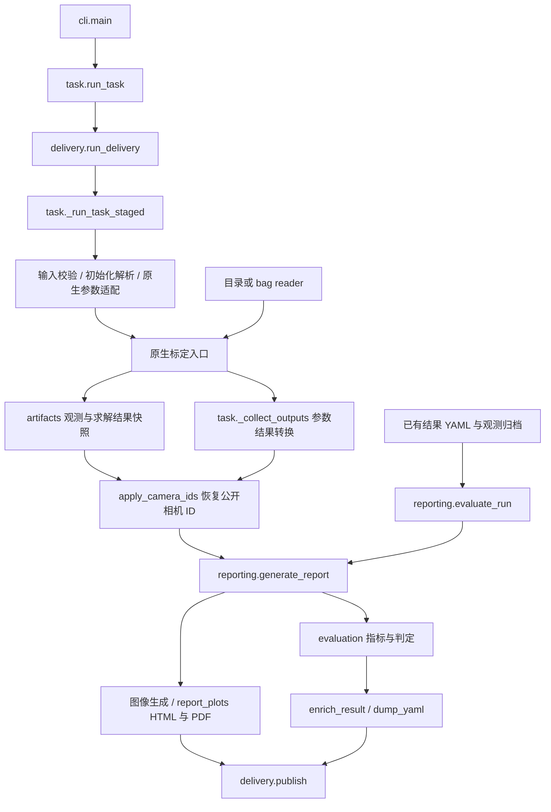

# 输入、算法求解、输出：代码位置与手动修改指南

本文对应当前 v1.0.0 源码，重点说明输入、输出应在哪里修改，以及怎样让修改生效。
完整参数定义见[任务参数](TASK_PARAMETERS_ZH.md)，使用方法见
[使用指南](USER_GUIDE_ZH.md)，算法原理见[源码导读](SOURCE_CODE_DEEP_DIVE_ZH.md)。

## 1. 先看三个部分在哪里

当前是**按职责分层**，没有物理拆成 `input/`、`solver/`、`output/` 三个目录。
输入与输出主要在同一个 Python 包中，`task.py` 负责跨层调度。

| 部分 | 主要源码位置 | 职责 |
|---|---|---|
| 输入 | [kalibr_no_ros](../src/python/kalibr_no_ros/)、[kalibr_bag_io](../src/python/kalibr_bag_io/) | 任务与辅助 YAML、初始化、数据校验、目录/bag 读取、传入原生入口的参数 |
| 算法求解 | [src/kalibr](../src/kalibr/)、[src/camera_models](../src/camera_models/) | 角点检测、初始化、残差、参数优化、异常点处理及相机模型 |
| 输出 | [kalibr_no_ros](../src/python/kalibr_no_ros/) 中的 `artifacts.py`、`evaluation.py`、`reporting.py`、`report_plots.py`、`delivery.py` | 收集观测、计算指标与判定、生成图像和报告、交付命名文件 |
| 执行支持 | [kalibr_runtime](../src/python/kalibr_runtime/) | 检测/优化执行预算、可选计时与内存诊断 |

**如果只改输入格式、结果字段或报告排版，一般不需要修改优化器。**
如果改了图像选择、角点检测参数或参与优化的变量，则会影响标定数值，需要按算法改动验证。

### 常用修改入口速查

下面文件名均可在本文后续表格中点击打开。

| 想修改什么 | 首先看哪里 | 还需关注 |
|---|---|---|
| 数据路径、相机 ID、模型、板参数、初值 | `config/` 内对应 YAML | 配置值修改通常不需要改源码 |
| task 支持的新字段或合法范围 | `task.py`、`validation.py` | 是否实际传入原生入口；不能只放行字段 |
| 目录 manifest、CSV、图像路径格式 | `kalibr_bag_io/directory.py` | 采集端格式、时间戳、ID 映射及读取测试 |
| 图像频率筛选 | `datasets.py`、目录/bag reader 的 `_decimate()` | 改变参与标定的数据；不是报告图片采样 |
| 初值字段及相机间变换 | `initialization.py` | `task.py` 的内部格式适配、坐标方向测试 |
| 最终结果文件名 | `delivery.py::result_name()` | `output.name` 已可直接配置 |
| 结果 YAML 的 `rms`、`alignment` | `delivery.py::enrich_result()` | 指标来源在 `evaluation.py`；结果读取在 `validation.py` |
| YAML 数字精度、数组/矩阵排版 | `task.py::dump_yaml()` 及其 dumper | 序列化往返，不能只比较文本外观 |
| 指标计算公式或合格判定 | `evaluation.py` | 缺失证据不得作为零值或通过 |
| 角点图、去畸变/极线校正图、绿色线宽 | `reporting.py::create_images()` | 几何计算在 `evaluation.py` |
| HTML 样式、PDF 排版、报告选哪 5 组图 | `report_plots.py` | HTML/PDF 共用选图，不能分别随机抽取 |
| 输出开关、哪些文件交给用户 | `evaluation.py::validate_output_options()`、`delivery.py::_destinations()` | 生成文件与保留文件是两个步骤 |

## 2. 实际调用关系



`run_delivery()` 先确定结果名称、检查输出位置，必要时为 Camera–IMU 查找相机结果；
求解和报告先在临时工作区完成，再由 `publish()` 写入用户输出目录。
`evaluate_run()` 是独立后处理入口，不调用检测器或优化器，也不重写原标定结果数值。
图中 `enrich_result()` 是标定运行回填质量字段的步骤；离线评价保留原结果 YAML 字节。

## 3. 输入代码怎样找、怎样改

### 3.1 配置与命令行

| 文件 | 关键入口 | 修改范围 |
|---|---|---|
| [cli.py](../src/python/kalibr_no_ros/cli.py) | `build_parser()`、`main()`、`_runtime_overrides()` | CLI 子命令、参数、命令行覆盖值 |
| [task.py](../src/python/kalibr_no_ros/task.py) | `load_task()`、`resolve_task_path()` | task 顶层结构、版本、相对路径解析 |
| [validation.py](../src/python/kalibr_no_ros/validation.py) | `validate_options()`、`validate_task()`、`load_target()`、`load_imu()`、`load_cameras()` | 字段白名单、类型、范围、板/IMU/相机结果校验 |
| [task.py](../src/python/kalibr_no_ros/task.py) | `_camera_arguments()`、`_imu_arguments()`、`_append_common_dataset()`、`_append_corner_refinement()` | 将公开 task 转成原生命令参数 |
| [task.py](../src/python/kalibr_no_ros/task.py) | `resolve_execution()` | YAML 与 CLI 执行预算合并 |
| [配置示例](../config/examples/v1.0.0/README_ZH.md) | 根目录、`all_params/` | 给用户复制的模板，不是程序默认值的实现 |

路径规则：task 中的数据、标定板、IMU、初始化、相机结果相对路径以 **task YAML 所在目录**
为基准；目录 manifest 中的流路径以 **数据集根目录**为基准。不要改成依赖启动命令的工作目录。

例如，仅想把亚像素窗口设成 7、最大位移设成 1 像素，修改任务即可：

```yaml
calibration:
  window_half_size_px: 7
  max_displacement_px: 1.0
```

这不需要编译，但需要重新检测/标定才会体现在结果中。修改 `all_params/` 中的值只改变
示例；字段省略时，程序仍保留原生默认窗口 2、最大位移 `sqrt(1.5)`。
输出选项的省略值集中在 `evaluation.py::validate_output_options()`；算法参数的省略值
还可能来自原生入口或 C++，不能只改某一份示例就认为全局默认值已经改变。

### 3.2 目录、bag 与传感器 ID

| 文件 | 关键入口 | 职责 |
|---|---|---|
| [factory.py](../src/python/kalibr_bag_io/factory.py) | `detect_dataset_format()`、`open_dataset()` | 选择 ROS1、ROS2、目录后端 |
| [directory.py](../src/python/kalibr_bag_io/directory.py) | `DirectoryReader.__init__()`、`sensor_topic()` | 读取根目录 `dataset.yaml`，将传感器 ID 映射到数据流 |
| 同上 | `IndexedDirectoryImageDataset`、`_read_csv()`、`_parse_timestamp()`、`read_imu()` | 图像索引、CSV 字段、整数纳秒时间戳、IMU 数据 |
| 同上 | `_crop()`、`_decimate()`、`_decode_image()` | 时间裁剪、频率筛选、文件图像解码 |
| [reader.py](../src/python/kalibr_bag_io/reader.py)、[image_codec.py](../src/python/kalibr_bag_io/image_codec.py) | bag reader 与图像解码实现 | bag 消息索引、读取与图像编码适配 |
| [datasets.py](../src/python/kalibr_no_ros/datasets.py) | `BagImageDatasetReader`、`BagImuDatasetReader` | 向原生 Kalibr 提供兼容读取接口，同时支持目录与 bag |

目录数据的对应关系是：

```text
task.cameras[].id
    → dataset.yaml 的 cameras[].id
    → images 图像目录 + timestamps CSV
    → CSV 中每条记录指定的图像
```

因此目录 task 可以不填 `topic`，也不用再次填写每台相机图像目录。内部 reader 仍使用一个
流键传递数据，省略 topic 时可由 ID 生成；这不代表目录输入需要 ROS 话题。
Camera–IMU 使用相机标定结果中的相机 ID 与 manifest 对应。

Kalibr 目录读取与校验不依赖 `meta/*`。采集工程对 `meta/` 的追溯、校验与 bag 导出需求
属于采集端；不要在此处重新增加该依赖。目录格式的完整示例见
[数据集与输出说明](DATASET_WORKFLOW_ZH.md)。

手动改格式时，先判断能否只修改 manifest 的路径映射。若确实要改 CSV 列名或结构，
需要同时维护采集端导出、这里的 reader、文档和 `tests/test_directory_io.py`。
保持时间戳整数纳秒、相机 ID 一致、图像顺序稳定；更改抽帧逻辑后还需核对实际选中的帧。
`dataset.frequency_hz` 是基于时间的筛选，不能把它直接理解为固定“每 N 帧取一帧”。

### 3.3 初始化和相机结果输入

| 文件 | 关键入口 | 职责 |
|---|---|---|
| [initialization.py](../src/python/kalibr_no_ros/initialization.py) | `validate_initialization()`、`_validate_camera_document()`、`canonical_initialization()` | 初值维数、变换矩阵、相机顺序、内部标准化 |
| [task.py](../src/python/kalibr_no_ros/task.py) | `resolve_initialization()`、`_write_initialization_config()`、`_legacy_camchain()` | 初值文件解析、原生初始化与 camchain 适配 |
| [delivery.py](../src/python/kalibr_no_ros/delivery.py) | `discover_camera_result()`、`apply_camera_ids()` | Camera–IMU 自动查找结果；将原生 `camN` 映射回公开 ID |
| [conversion.py](../src/python/kalibr_no_ros/conversion.py) | 相机结果/camchain 转换函数 | 项目结果与外部格式互操作 |

当前初值写在 `cameras.<id>.T_cn_cnm1` 中；它将 **task 列表前一台相机**坐标变到当前相机，
不是按 ID 字符串排序。例如 task 顺序为 `[cam2, cam0, cam5]`，则 `cam0` 下的矩阵将
cam2 点变到 cam0，`cam5` 下的矩阵将 cam0 点变到 cam5。第一台没有该变换。
内部仍有 `T_cam_from_previous` 适配，旧写法兼容代码不等于推荐用户格式。

Camera–IMU 没给 `camera_calibration.path` 时，在输出目录找到唯一有效匹配结果才会继续；
有多个候选不能随便取第一个。独立 `validate` 没有输出目录上下文，需显式给该路径。
更改读写变换时，按 ${}^{A}_{B}\mathbf T$ 将 B 系点变到 A 系的约定做组合、求逆和原点测试。

## 4. 算法求解只需知道这些边界

| 位置 | 内容 |
|---|---|
| [kalibr_calibrate_cameras](../src/kalibr/calibration/kalibr/python/kalibr_calibrate_cameras) | 单目/多目原生入口和标定阶段调度 |
| [CameraIntializers.py](../src/kalibr/calibration/kalibr/python/kalibr_camera_calibration/CameraIntializers.py) | 相机内参与 baseline 初始化；文件名确实是 `Intializers` |
| [CameraCalibrator.py](../src/kalibr/calibration/kalibr/python/kalibr_camera_calibration/CameraCalibrator.py) | 相机视图、误差项、活动参数及增量标定 |
| [kalibr_calibrate_imu_camera](../src/kalibr/calibration/kalibr/python/kalibr_calibrate_imu_camera) | Camera–IMU 原生入口 |
| [IccSensors.py](../src/kalibr/calibration/kalibr/python/kalibr_imu_camera_calibration/IccSensors.py)、[IccCalibrator.py](../src/kalibr/calibration/kalibr/python/kalibr_imu_camera_calibration/IccCalibrator.py) | 传感器模型、连续时间轨迹、残差与联合求解 |
| [TargetExtractor.py](../src/kalibr/calibration/kalibr/python/kalibr_common/TargetExtractor.py) | 检测 worker、任务提交与有序回收 |
| [optimization](../src/kalibr/optimization/)、[camera](../src/kalibr/camera/)、[trajectory](../src/kalibr/trajectory/) | C++ 优化器、相机与标定板、轨迹基础实现 |
| [camera_models](../src/camera_models/) | radtan5、radtan8、九参数 OpenCV fisheye 扩展 |

新增一个影响检测/求解的配置量，通常要贯通：配置校验 → task 参数适配 → 原生入口 →
实际使用处；若跨 Python/C++ 或检测进程，还要覆盖绑定与 pickle。
只改 HTML 或 YAML 输出字段时，不应调整残差、停止条件或异常点选择。

## 5. 输出代码怎样找、怎样改

### 5.1 观测、计算、排版、文件交付分别维护

| 文件 | 关键入口 | 负责什么 |
|---|---|---|
| [artifacts.py](../src/python/kalibr_no_ros/artifacts.py) | `run_context()`、`RunContext.record_detection()`、`publish_camera()`、`publish_imu_camera()` | 从原生执行收集帧、角点、最终残差、位姿、是否使用及筛选事件；是求解到输出的桥梁 |
| [evaluation.py](../src/python/kalibr_no_ros/evaluation.py) | `compute_metrics()`、`assess_metrics()`、`distribution()` | 重投影、对齐误差、统计量及规则判定，不回馈求解 |
| 同上 | `stereo_geometry()`、`rectified_points()`、`rectification_maps()` | 双目校正几何、角点变换及图像映射 |
| [reporting.py](../src/python/kalibr_no_ros/reporting.py) | `write_archive()`、`load_archive()` | 观测 CSV/压缩文件与清单的序列化和读取 |
| 同上 | `create_images()`、`export_opencv()` | 角点图、原始双目图、校正图及 OpenCV 导出 |
| 同上 | `generate_report()`、`evaluate_run()` | 标定后输出编排、已有证据的离线评价 |
| [report_plots.py](../src/python/kalibr_no_ros/report_plots.py) | `report_figures()`、`render_reports()` | Camera system、Estimated poses、Polar/Azimuthal error、Reprojection errors 等图表及 HTML/PDF |
| 同上 | `_STYLE`、`_summary_sections()`、`_pdf_table_page()`、`stereo_comparison_page()` | HTML 样式、摘要表格、PDF 表格与上下双目图排版 |
| [delivery.py](../src/python/kalibr_no_ros/delivery.py) | `result_name()`、`enrich_result()`、`_destinations()`、`publish()` | 结果命名、质量字段、文件筛选与最终发布 |
| [task.py](../src/python/kalibr_no_ros/task.py) | `_collect_outputs()`、`_native_cameras_to_result()`、`dump_yaml()` | 原生结果转项目结果、稳定 YAML 序列化；当前 schema 为 `"1.0.0"` |

扩展报告所需的中间量时，先检查 `artifacts.py` 是否已收集；已存在的量直接用于输出。
确实缺少时，在对应原生阶段增加只读采集，并同时更新归档写入、读取和测试。
不要为了绘图重新检测一次角点，否则无法证明绘出的就是最终参与优化的观测。

### 5.2 最终文件与内部临时文件

双目默认名称例如 `camera_calibration_cam0_cam1`，也可配置：

```yaml
output:
  name: camera_calibration_cam0_cam1_pinhole_equi
```

| 最终产物 | 控制位置/配置 |
|---|---|
| `<name>.yaml`、`<name>.report.html`、`<name>.report.pdf` | `delivery.py::_destinations()` 中的主文件映射 |
| `<name>.results.txt` | `output.export_text` |
| `<name>/metrics.json` | `output.save_metrics` |
| `<name>/observations/` | `output.archive_observations`，历史另由 `archive_selection_history` 控制 |
| `<name>/visualizations/` | `output.visualizations.enabled` |
| `<name>/images/`、`<name>/opencv/` | `output.copy_used_images`、`output.export_opencv` |
| `<name>/` 内日志、validation、assessment、observability、清单等可用诊断 | `output.save_diagnostics`；某些诊断仅在对应阶段产生 |
| `<name>/timing.json` | profile 构建且显式请求计时，与普通报告开关分开 |

源码中仍能搜到 `calibration.yaml`、`report.pdf`：它们是内部临时工作区文件名，
最终交付由 `delivery.py` 重命名。不要把所有字符串全局替换成某个模型专用名称。

`save_diagnostics: false` 控制交付内容，不表示跳过输入校验或必要的可观性检查。
可选证据目录的 `.inventory.json` 用于受管文件检查；更改清理逻辑时必须保护同目录其他任务
和未登记文件。共用输出根目录时给不同模型或不同运行使用不同 `output.name`，或使用独立目录。

### 5.3 示例：修改结果字段、指标和判定

当前 `enrich_result()` 将计算出的每目 RMS 写入相机的标量 `rms`，将相邻外参的校正后
对齐 RMS 写入标量 `alignment`，单位均为像素；缺失证据为 `null`。
结果不写 `from_camera` 或 `transform_convention`，变换方向由契约说明。

如果只想修改展示名称或小数位，优先修改报告层。若要改变结果 YAML 的字段，需要：

1. 修改 `delivery.py::enrich_result()` 或 `task.py` 的结果转换处。
2. 在 `validation.py::load_cameras()` 等结果读取处更新允许字段及类型，保证 Camera–IMU 可读取。
3. 检查 `task.py::_legacy_camchain()` 与 `conversion.py` 的转换，避免把质量字段误传成原生参数。
4. 用 `test_delivery.py`、`test_v1_contract.py`、`test_conversion_v1.py` 验证读写与下游兼容。

如果要改变指标算法，修改 `evaluation.py`，不要在 HTML 或 PDF 内各计算一套。
当前重投影 RMS 按二维角点距离计算：`sqrt(mean(dx² + dy²))`，并非将 x/y 当成两倍样本数。
规则阈值通常直接写 `output.assessment.rules`；只有新增判定机制才需要改 `assess_metrics()`。
参考评级用于展示，`rules: []` 不代表生产验收通过。

### 5.4 示例：修改 HTML/PDF 与极线图

当前链路是：

```text
create_images(): 生成 original_XXXX 与 rectified_XXXX 图像
    → render_reports(): 固定随机种子选最多 5 组，再排序
    → HTML: 每组上方双目原图、下方校正图
    → PDF: stereo_comparison_page() 每组一页，上原图、下校正图
```

| 想改的效果 | 修改处 |
|---|---|
| 网页宽度、留白、字体、卡片布局 | `report_plots.py::_STYLE` |
| 摘要字段与表格列 | `_summary_sections()`；PDF 分页还看 `_pdf_table_page()` |
| PDF 上下图大小、间距、页标题 | `stereo_comparison_page()` |
| 报告从 5 组改为其他数量 | `render_reports()` 中共享的 `min(5, len(candidates))`，同时维护说明文字与测试 |
| 更换随机策略 | 同一函数中的 `random.Random(0)`；保留抽取后排序及 HTML/PDF 共用集合 |
| 极线颜色、厚度 | `reporting.py::create_images()` 内 `cv2.line()`；当前 BGR `(0, 255, 0)`、厚度 3 校正图像像素 |
| 校正视场和分辨率 | 先用 `output.rectification`；几何实现才改 `evaluation.py` |

`max_pairs` 控制生成图对上限，`max_frames_per_camera` 控制每目可视化上限；
它们不是报告固定展示 5 组的开关，也不会改变求解所用图像。
当前从可用候选中随机抽取并按文件序号排序；单个双目相机对的图像生成序号对应帧顺序。
如果扩展到多个相机对，要明确按相机对分组还是跨组按时间排序，不能假设路径排序等于全局时间排序。

HTML 的统计图内嵌，但双目原图/校正图使用相对路径引用，转交 HTML 时应保留对应证据目录。
PDF 内嵌所选图像，可单独转交；保留高分辨率图像会使文件变大。
当前公开报告应改 `report_plots.py`，而非只改原生 `CameraUtils.py` 中旧报告函数。

### 5.5 示例：新增输出开关或文件

1. 在 `evaluation.py::validate_output_options()` 添加字段、默认值、类型和范围校验。
2. 在 `reporting.py` 相应步骤读取开关，生成文件；纯排版留在 `report_plots.py`。
3. 若是新的文件类别，在 `delivery.py::_destinations()` 明确交付规则。
4. 若离线评价需要新证据，同时更新 `write_archive()`、`load_archive()` 和 `evaluate_run()` 的复制范围。
5. 更新配置示例、参数说明，并验证开关关闭不交付、开启可读取、多任务共用目录互不覆盖。

仅生成在临时目录中的文件不一定会出现在最终目录；仅在 YAML 里新增字段也不会自动接入逻辑。

## 6. 修改后怎样生效与验证

以下命令在仓库根目录执行，所有构建最多 4 jobs。

### 6.1 只修改文档或本地 YAML

文档不需要编译。YAML 改完用实际安装入口校验，再按需要运行任务：

```bash
install/release/bin/kalibr-noros validate --config path/to/task.yaml
```

把示例路径替换为实际配置。校验不会执行角点检测或优化；通过不等于数据一定能成功标定。
初始化、模型或检测参数改动需要重新标定；已有观测上的报告排版改动可离线重生成。

### 6.2 修改 Python 或 C++ 源码

生产版：

```bash
cmake --preset release
cmake --build --preset release --parallel 4
cmake --install build/release
```

性能版及功能检查：

```bash
cmake --preset project-profile
cmake --build --preset project-profile --parallel 4
cmake --build --preset project-profile --target check --parallel 4
cmake --install build/project-profile
```

当前只提供 `release`、`project-profile` 两种 preset。修改 Python 后也要重新 configure：
[ProjectBuild.cmake](../cmake/ProjectBuild.cmake) 中的 `copy_python_package()` 在该阶段同步源码。
`ninja: no work to do` 本身不能证明 Python 修改已经同步。不要手工编辑 `build/`、`install/`
或 `.deps/` 中的副本；运行时明确使用刚更新的安装入口，避免 PATH 指向旧版本。

只改某个 Python 模块时，先运行相关检查，例如报告与排版：

```bash
PYTHONPATH=src/python:.deps/python MPLCONFIGDIR=/tmp/kalibr-mpl python3 -m unittest discover -s tests -p 'test_report*.py'
git diff --check
```

涉及原生绑定的检查使用 profile 的 `check` 目标，不能仅用纯 Python 检查代替。

| 改动 | 对应检查文件 |
|---|---|
| 目录、bag、读取适配 | [test_directory_io.py](../tests/test_directory_io.py)、[test_bag_io.py](../tests/test_bag_io.py)、[test_compat_datasets.py](../tests/test_compat_datasets.py) |
| task、CLI、公开契约 | [test_cli.py](../tests/test_cli.py)、[test_v1_contract.py](../tests/test_v1_contract.py) |
| 初始化 | [test_initialization.py](../tests/test_initialization.py)、[test_camera_initialization.py](../tests/test_camera_initialization.py)、[test_imu_camera_initialization.py](../tests/test_imu_camera_initialization.py) |
| 观测采集与归档 | [test_run_artifacts.py](../tests/test_run_artifacts.py)、[test_reporting.py](../tests/test_reporting.py) |
| 报告排版与图像 | [test_report_plots.py](../tests/test_report_plots.py)、[test_reporting.py](../tests/test_reporting.py) |
| 命名、结果字段、交付保护 | [test_delivery.py](../tests/test_delivery.py)、[test_conversion_v1.py](../tests/test_conversion_v1.py) |

### 6.3 只改报告，用已有观测重生成

原标定必须保存 `output.archive_observations: true`，图像仍可读取或已保存副本。
新建评价配置，例如 `evaluation_local.yaml`：

```yaml
schema_version: "1.0.0"
kind: calibration_evaluation
output:
  save_metrics: true
  archive_observations: true
  visualizations:
    enabled: true
    max_frames_per_camera: 60
    max_pairs: 60
    sampling: uniform
```

用更新后的程序写到与原运行目录分离的新目录：

```bash
install/project-profile/bin/kalibr-noros evaluate \
  --run path/to/original_output/camera_calibration_cam0_cam1_pinhole_equi.yaml \
  --config evaluation_local.yaml \
  --output-dir path/to/report_preview
```

示例省略的评价参数使用程序默认值。若希望只改排版，需把原运行的 `rectification`、
`evaluation_pairing_tolerance_s`、判定规则也复制过来，以保持后处理口径。
数据集搬动后可加 `--dataset` 指定新根目录。
只有 `metrics.json` 时只能基于汇总值重新判定和生成有限报告，不能恢复角点、重绘这些图像
或修改依赖角点的校正设置。结果 YAML 单独存在也不足以恢复这些证据。

### 6.4 常见“改了却没生效”的原因

| 现象 | 检查位置 |
|---|---|
| YAML 新字段报 unknown field | `task.py`、`validation.py` 或 `validate_output_options()` 白名单 |
| YAML 接受了，但求解行为没变 | `task.py` 参数适配、原生入口和实际消费处是否贯通 |
| 源码改了，安装命令还是旧效果 | 是否重新 configure、install；实际执行的是哪一个 preset 的入口 |
| 文件生成过，最终输出里没有 | `delivery.py::_destinations()` 与相应开关 |
| HTML 有新效果，PDF 没变 | HTML CSS 不控制 PDF；检查 `stereo_comparison_page()` 等 Matplotlib 布局 |
| 报告缺少双目对比图 | `visualizations.enabled`、可用共视角点、原图路径、配对是否足够 |
| Camera–IMU 提示相机结果不唯一 | 同目录存在多份模型结果；显式配置 `camera_calibration.path` |
