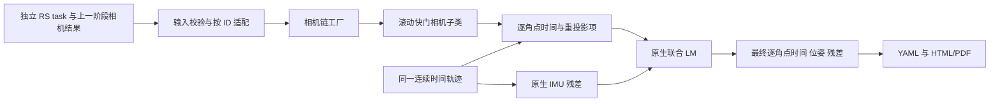

# 滚动快门 Camera–IMU 联合标定

新增 `job: camera_imu_rolling_shutter_calibration`，入口为
`kalibr-noros calibrate imu-camera-rs`。它复用相机检测、原生 IMU 初始化、连续时间样条和
LM，把每台相机的行时间加入联合求解。原 `camera_calibration` 和
`camera_imu_calibration` 的默认模型、参数和阶段顺序保持不变。

## 运行顺序与配置

先用停稳图像完成相机内参与双目外参标定，再用动态相机＋IMU 数据执行新任务：

```bash
kalibr-noros calibrate cameras --config stereo_camera_calibration_task.yaml --output-dir result
kalibr-noros calibrate imu-camera-rs --config camera_imu_rolling_shutter_calibration_task.yaml --output-dir result
```

新任务引用 `camera_calibration.path`；省略时仍按现有规则从输出根目录查找唯一匹配的
相机标定结果。目录通过 `dataset.yaml` 映射 ID，bag 需要话题。相机光学模型仍是
`pinhole-equi` 等原有模型，不把快门类型拼到模型名称中。

配置入口：
[简洁示例](../config/examples/v1.0.0/camera_imu_rolling_shutter_calibration_task.yaml)、
[完整注释示例](../config/examples/v1.0.0/all_params/camera_imu_rolling_shutter_calibration_task_full.yaml)。

| 字段 | 默认值、单位与合法范围 | 作用 |
|---|---|---|
| `rolling_shutter` | 新任务必填，映射 | 键必须与相机结果 ID 完全一致；支持不同 ID 和多目顺序 |
| `line_delay_s` | `0.0`，秒/行，有限实数 | 初值；正值表示原图 y 增大时采样更晚，负值表示反向 |
| `estimate` | `true`，布尔值 | 每目独立优化；false 时固定给定值 |
| `max_abs_line_delay_s` | 估计时必填，无默认；有限正数且大于初值绝对值 | 对称搜索范围，同时决定样条需要预留的行时间范围 |

`estimate: false` 可以不提供范围；若提供仍校验合法性。`line_delay_s: 0.0` 且
`estimate: false` 表示新路径中的整帧单时刻模型。示例的 20 μs/行是待用户按模式调整的
范围，不是所有设备的默认值，不能根据 `dataset.frequency_hz` 的降采样率推算。
初始行时间不会自动从历史诊断或采集端 `meta/` 读取。

原初始化文档 `camera_imu_calibration_initialization` 仍可用于外参、时间偏移及 IMU seed；
`direct/refine` 语义不变。新任务的相机整体时间偏移以参考行的有效采样时刻为参考，
已有全局快门任务的时间偏移只能作为近似初值，不应当作相同物理事件的精确值。

## 输入、求解与输出的分层



- 输入：`src/python/kalibr_no_ros/rolling_shutter.py` 校验新字段，`task.py` 将公开相机 ID
  按结果列表顺序转换为原生 ID。`cli.py` 和 `delivery.py` 提供新入口与独立交付名称。
- 求解：`src/kalibr/calibration/kalibr/python/kalibr_imu_camera_calibration/IccRollingShutter.py`
  提供相机、相机链与标定器子类。原相机链仅增加工厂方法；普通任务仍创建原相机对象。
  新任务由已有原生入口显式选择子类，不复制整套 IMU 求解流程。
- 输出：`artifacts.py` 保存每角点最终时刻和位姿；`evaluation.py` 计算已有证据的 RMS；
  `report_plots.py` 在 HTML/PDF 显示快门参数与时间含义。`evaluate` 不重新优化。

## 联合模型与状态

原图高度为 H，参考行固定为 `y_ref = (H−1)/2`，2160 行图像对应 1079.5。
参考行是参数化约定，不是主点，也不是已知的硬件曝光起点。角点 j 使用**观测到的原图行号**：

```text
t_ij = t_frame_i + timeshift_cam_imu + (y_ij − y_ref) × line_delay_s
p_camera = T_camera_imu × inverse(T_world_imu(t_ij)) × p_target
r_ij = measurement_ij − projection(p_camera)
```

变换方向统一为 `${}^{A}_{B}T` 将 B 系点变换到 A 系。每个角点在同一条连续时间样条上
查询其自己的位姿；IMU 仍使用各自样本时刻。新路径没有使用离线诊断中的 5 Hz 像素速度
近似，没有额外加入位姿或行时间先验，也不引入 Ceres。

联合状态包括原有轨迹控制点、IMU bias 等活动状态、相机—IMU 外参、启用的整体时间偏移，
以及每目行时间。内参和畸变固定。`recompute_camera_chain_extrinsics` 默认 false，
显式 true 时仅放开相邻相机外参。原生像素协方差、IMU 残差、鲁棒策略、优化器与停止阈值
沿用原 Camera–IMU 路径；本版不加入旧独立 RS 相机脚本的自适应像素协方差。

行时间采用 `tau = bound × tanh(q)`，q 是无量纲状态；通过原生表达式传播解析 Jacobian。
这是有界变量参数化，不是残差先验。初值转换为 `atanh(seed/bound)`，不对更新结果做硬截断。
原帧时间偏移的支持范围继续使用 `time_offset_padding_s`；新路径额外为行时间变化预留
样条控制点范围。允许的逐行时刻范围未完整落在样条支持区间内的帧会排除并注明原因。公共帧时移超出原生支持范围
仍明确报错，不静默钳制时间。

新任务结束后进行包含行时间变量的可观性检查；原生数值秩亏不生成成功结果。
数值满秩仍可能存在弱约束方向：报告同时显示 native rank、operational rank 与
`weakly_observable` 等质量提示，不能把收敛或数值满秩解释为硬件精度保证。
如果估计达到配置范围的 99.5%，任务报错并提示检查数据或增加范围，避免把边界当可靠估计。
`recover_covariance` 可额外恢复局部协方差，并通过链式导数把 q 的标准差换算为秒/行；
它不等同于硬件实测精度或全局置信区间。

## 结果与报告

默认文件前缀为新 job 加相机与 IMU ID，也可用 `output.name` 指定独立名称。结果继续采用
`schema_version: "1.0.0"`、`kind: calibration_result`、`calibration_type: camera_imu`，
每个相机新增 `shutter` 映射，现有内参、rms、T_cam_imu 与相邻 T_cn_cnm1/alignment 保留。

| 结果字段 | 含义 |
|---|---|
| `type` | `rolling_shutter` |
| `line_delay_s` | 带符号的秒/行 |
| `reference_row_px` | `(H−1)/2`，整体时移所对应的参考行 |
| `first_to_last_row_span_s` | `(H−1) × abs(line_delay_s)`，不含消隐，非曝光持续时间 |
| `estimated` | 是否参与本次优化 |
| `max_abs_line_delay_s` | 估计模式使用的搜索范围 |
| `line_delay_std_s` | 仅显式恢复协方差时提供的局部标准差 |

观测归档启用时，角点的 `extra` 中包含 `solver_timestamp_s`、`row_time_offset_s` 和
该时刻的 `T_camera_target`；帧位姿仍保存参考行时刻，并注明 `pose_time_reference`。
所有指标依赖最终已使用观测，不以缺失值冒充零。

报告中的二维重投影 RMS 来自完整逐角点时间模型。普通 OpenCV 极线校正和示意图只校正
光学畸变及双目几何，**不消除滚动快门运动**；一维 alignment 可能仍受行时间影响，
不能用它与二维 RMS 直接比较。参考评级仍与显式生产判定规则分开。完整图像去滚动快门
通常还需要轨迹与场景深度，本任务不把一阶角点诊断伪装成这样的图像校正。

## 验证与维护

`test_rolling_shutter.py` 检查独立任务、ID 映射、非法输入与普通任务隔离；
`test_rolling_shutter_native.py` 使用真实原生表达式和重投影项，检查零行时间一致性、
正负行时间恢复、整体时移分离、解析 Jacobian 和协方差参数顺序。
`test_run_artifacts.py` 另检查逐角点最终时间和位姿归档的往返一致性。完整检查在 `project-profile` 的显式
`check` 目标中执行；release 不加入测试或性能采样。真实数据使用新结果名称，保留已有
相机及全局快门 Camera–IMU 结果作同源核查。
