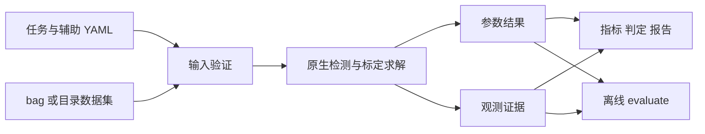

# 输入、求解与输出源码导读

本文帮助维护当前发布源码。模型的完整投影公式见[相机模型](CAMERA_MODELS_ZH.md)，
配置与默认值见[任务参数](TASK_PARAMETERS_ZH.md)，物理初值见
[初始化说明](INITIALIZATION_ZH.md)。

需要直接动手修改输入格式、结果字段或 HTML/PDF 报告时，见
[输入输出代码修改指南](IO_CODE_MAINTENANCE_ZH.md)，其中列出了具体文件、函数和验证步骤。

## 1. 工程结构与职责

```text
src/python/kalibr_no_ros     任务、输入验证、初始化、结果与评价
src/python/kalibr_bag_io     ROS-free bag/目录 I/O
src/python/kalibr_runtime    执行预算和可选运行诊断
src/kalibr/foundation        Eigen/NumPy、坐标、日志等基础库
src/kalibr/camera            原生投影、标定板和相机误差项
src/kalibr/optimization      原生优化器、表达式和稀疏矩阵
src/kalibr/trajectory        B-spline 与连续时间轨迹
src/kalibr/calibration       增量估计、相机和 Camera–IMU
src/kalibr/third_party       AprilTag 检测
src/camera_models           radtan5/radtan8 与九参数 OpenCV fisheye
```

公开 CLI 的职责是把严格任务转换为原生入口所需的数据和参数。核心求解代码仍在
`src/kalibr`，不通过替换优化器类或修改残差来实现 I/O 和报告功能。



`task.py` 处理路径与执行参数，`validation.py` 检查输入契约；`artifacts.py`
收集已发生的观测与筛选事件；`evaluation.py` 计算指标和规则判定；`reporting.py`
生成报告和图像。正式输出不依赖性能诊断开关。

## 2. 坐标、时间与输入

所有变换遵循：

```text
p_target = T_target_source * p_source
```

${}^{A}_{B}\mathbf T$ 将 B 系点变到 A 系。`T_cam_imu` 将 IMU 点变到相机，
`T_cn_cnm1` 将前一相机点变到当前相机。连续变换按坐标匹配相乘，反向使用逆矩阵；
平移统一为 m，角速度为 rad/s，加速度为 m/s²。

数据集原始时间戳用整数 ns 保存。进入原生连续时间模型时按其接口转换为秒，
不得先将绝对时间戳转成低精度浮点再排序或同步。

`kalibr_bag_io` 支持 ROS1、ROS2 与目录。目录读取器使用 `dataset.yaml` 将
相机/IMU ID 解析为文件路径；bag 读取器以 topic 选择流。Camera–IMU 读取已生成的
相机结果，使用结果中的相机 ID 对应当前目录 manifest；适配到原生 camchain
只在内部进行，不改写输入结果。

图像索引与解码分开，避免主进程提前保留所有图像。原生
`kalibr_common/TargetExtractor.py` 组织检测 worker、有界在途任务与结果回收。
结果按输入序号归并；硬退出、无法 pickle 或工作进程异常必须向调用方报告，
不能以少帧成功掩盖失败。

## 3. 相机标定

入口为 `calibration/kalibr/python/kalibr_calibrate_cameras`，主要实现位于同级
`kalibr_camera_calibration`。

阶段顺序保持：

1. 每台相机独立读取与检测 AprilGrid，角点使用全局 ID。
2. 解析初始化，每台相机执行内参/畸变初始化和单相机 LM。
3. 按时间容差建立 target view，再由共同角点建立相机共视图。
4. 通过 PnP 相对位姿中值和成对 stereo LM 初始化 baseline。
5. 全批量 refinement 联合优化相机参数、baseline 与标定板位姿。
6. 原生增量估计按 view 加入问题，计算信息增益，接受/回滚并过滤异常点。

相机对 baseline 初始化是原生参数活动状态的特殊阶段：投影参数 active、畸变
暂时 fixed，后续联合阶段重新放开。明确设置 `freeze_intrinsics: true` 且所有
相机 seed 完整时，投影与畸变在上述所有优化阶段固定；baseline 和 target pose
仍参与优化。

`CameraIntializers.py` 管理前置初始化，`CameraCalibrator.py` 管理视图问题与
活动参数。`IncrementalEstimator.cpp` 处理增量接受、信息增益与回滚。
`shuffle: false` 保持数据库顺序；检测成功、时间同步成功、共视图连接和增量接受
是不同状态，输出证据不能混淆它们。

## 4. Camera–IMU 标定

入口为 `kalibr_calibrate_imu_camera`，主要实现位于
`kalibr_imu_camera_calibration/IccSensors.py` 与 `IccCalibrator.py`。

相机内参与 baseline 从 `camera_calibration.path` 指定的结果读入。该阶段不会
重新执行完整相机内参标定。原生顺序为时间偏移互相关、旋转/gyro bias 初值、
连续时间 spline 初始化、残差建图与最终联合 LM。

连续时间姿态、位置和 bias spline 允许在各传感器的测量时刻查询状态。重投影残差
由相机观测与预测像素组成；gyro/accel 残差使用对应 IMU 模型及噪声权重。
`calibrated` 不表示外参、时间偏移或 bias 已知；它表示 IMU 内部尺度/轴不正交项
不再作为额外标定状态。

`recompute_camera_chain_extrinsics` 只决定联合阶段相机链 baseline 是否放开。
多 IMU 的 reference 表示参考 IMU 的坐标系/时钟，属于算法定义。
`direct` 与 `refine` 仅改变允许的初始化阶段，不增加吸引参数靠近 seed 的残差。
hard rank 失败必须保留诊断并失败，operational rank 用于表示较弱的可观方向。

## 5. 模型与原生优化器

原生 `pinhole-equi` 保持四内参加四畸变参数。独立
`kalibr_opencv_fisheye` 扩展只提供九参数模型：五个投影参数
`[fu,fv,cu,cv,alpha]` 与四个角度畸变系数，满足 `K[0,1] = fu * alpha`。
C++ 的 distortion、projection 与 camera 类型位于
`src/camera_models/opencv_fisheye/include/kalibr_no_ros/opencv_fisheye`；
对应 Python 绑定与设计变量使用同一包。

模型扩展需要投影/反投影、输入和参数 Jacobian、design variable、误差项、
Boost.Python pickle 与 YAML 维数处理同时一致。OpenCV 纯文件转换位于
`kalibr_no_ros/opencv_io.py` 和 `opencv_fisheye_io.py`，不依赖启动求解器。

原生优化器以误差项构建加权残差和 Jacobian，经变量缩放和稀疏线性代数求出更新。
LM 的阻尼、更新接受/回滚和停止规则由原生实现负责。Schur 消元用于分离局部位姿
与标定变量，不能因为只关注标定结果而删除局部位姿的贡献。

`kalibr_runtime` 仅配置已接入的 Optimizer2、增量估计器和检测阶段的执行预算，
不替换 Boost.Python 类；类型身份必须保持，使 C++ 绑定继续接受原生对象。
并行 Hessian 对每个固定分块独立累积，按既定顺序归并；直接构造 Hessian 的误差项
仍走自己的实现。数学正确性检查应包含这些误差项及 worker 异常传播。

## 6. 输出证据与维护检查

按任务与传感器 ID 命名的结果 YAML 是下游权威参数输入；可选 `metrics.json` 记录证据支持的量化值，
`assessment.json` 分离用户显式判定规则与显示用参考评级。不能把没有角点证据的
指标写成零，也不能以参考显示等级替代生产验收。

详细观测记录源序号、整数时间戳、帧/角点 ID、是否最终使用、预测值和残差。
筛选历史、原图副本和可视化分别受配置控制。离线 `evaluate` 只读取这些证据和
参数结果，绘图需要可访问的原图或副本，不隐式重跑检测。

输出目录清理由运行清单管理，先检查全部子文件再删除；保留未登记文件。
日志重定向、当前目录、命令行参数及运行上下文在异常后必须恢复，便于连续任务。

构建只使用 `release` 与 `project-profile`。release 的正式报告能力完整，
性能计时和内存探针关闭；profile 必须显式请求才保存诊断。最多 4 jobs，
Python 修改后重新 configure。profile 的 `check` 目标显式执行功能与数学检查，
测试不随默认构建或安装进入交付包。无 ROS 的 CMake 兼容宏只重现构建接口，
不加载 ROS 运行时。

定位问题时按症状查入口：数据/ID/时间错误先查 validation 与 datasets；
模型维数/alpha 丢失查模型和转换；使用帧变化查 detector、view 与增量状态；
Camera–IMU 结果异常查坐标、时钟和运动可观性；输出缺项查观测证据与输出配置。
